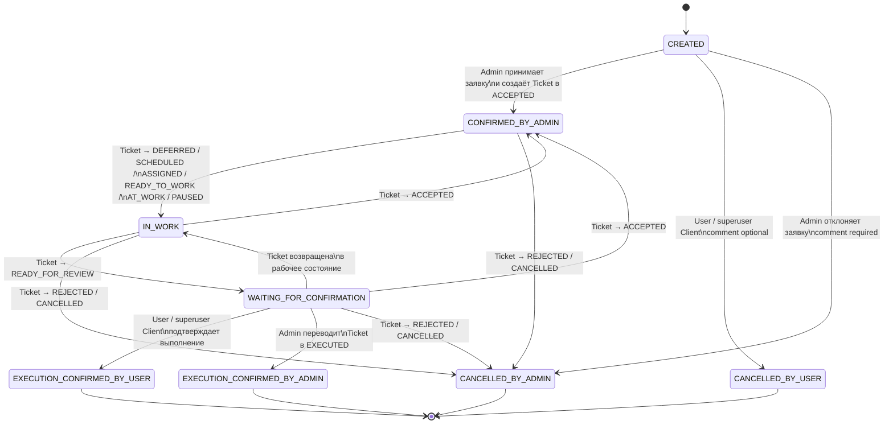

# UserTicket: статусы и синхронизация с Ticket

## Статусы UserTicket

```text
CREATED
CONFIRMED_BY_ADMIN
IN_WORK
WAITING_FOR_CONFIRMATION

EXECUTION_CONFIRMED_BY_USER
EXECUTION_CONFIRMED_BY_ADMIN

CANCELLED_BY_USER
CANCELLED_BY_ADMIN
```

## Terminal-статусы

```text
EXECUTION_CONFIRMED_BY_USER
EXECUTION_CONFIRMED_BY_ADMIN
CANCELLED_BY_USER
CANCELLED_BY_ADMIN
```

---

## Граф состояний UserTicket



---

## Таблица статусов UserTicket

| Код                            | Отображение                           | Terminal | Смысл                                                                                 |
| ------------------------------ | ------------------------------------- | :------: | ------------------------------------------------------------------------------------- |
| `CREATED`                      | Создана                               |    Нет   | User создал заявку. Связанная Ticket ещё не существует.                               |
| `CONFIRMED_BY_ADMIN`           | Подтверждена админом                  |    Нет   | Admin принял UserTicket и создал связанную Ticket сразу в `ACCEPTED`.                 |
| `IN_WORK`                      | В работе                              |    Нет   | Ticket находится в одном из рабочих или организационных состояний.                    |
| `WAITING_FOR_CONFIRMATION`     | Ожидает подтверждения                 |    Нет   | Ticket перешла в `READY_FOR_REVIEW`; результат ожидает подтверждения.                 |
| `EXECUTION_CONFIRMED_BY_USER`  | Выполнение подтверждено пользователем |    Да    | Автор UserTicket либо superuser Client подтвердил выполнение.                         |
| `EXECUTION_CONFIRMED_BY_ADMIN` | Выполнение подтверждено админом       |    Да    | Admin завершил Ticket в `EXECUTED`, не ожидая подтверждения User.                     |
| `CANCELLED_BY_USER`            | Снята пользователем                   |    Да    | UserTicket снята автором или superuser Client до создания Ticket.                     |
| `CANCELLED_BY_ADMIN`           | Снята админом                         |    Да    | Admin отклонил UserTicket либо связанная Ticket перешла в `REJECTED` или `CANCELLED`. |

---

## Прямое соответствие Ticket → UserTicket

Это соответствие действует, пока UserTicket не находится в terminal-статусе.

| Состояние Ticket         | Состояние UserTicket           | Комментарий                                      |
| ------------------------ | ------------------------------ | ------------------------------------------------ |
| Ticket ещё не существует | `CREATED`                      | User создал заявку, но Admin ещё не принял её.   |
| `ACCEPTED`               | `CONFIRMED_BY_ADMIN`           | Ticket создана Admin сразу в `ACCEPTED`.         |
| `DEFERRED`               | `IN_WORK`                      | Работа существует, но отложена.                  |
| `SCHEDULED`              | `IN_WORK`                      | Работа запланирована.                            |
| `ASSIGNED`               | `IN_WORK`                      | Исполнитель назначен.                            |
| `READY_TO_WORK`          | `IN_WORK`                      | Исполнитель и план определены.                   |
| `AT_WORK`                | `IN_WORK`                      | Исполнитель выполняет работу.                    |
| `PAUSED`                 | `IN_WORK`                      | Работа временно остановлена.                     |
| `READY_FOR_REVIEW`       | `WAITING_FOR_CONFIRMATION`     | Результат ожидает подтверждения.                 |
| `EXECUTED`               | `EXECUTION_CONFIRMED_BY_ADMIN` | Только если UserTicket ещё не подтверждена User. |
| `REJECTED`               | `CANCELLED_BY_ADMIN`           | Только если UserTicket ещё не terminal.          |
| `CANCELLED`              | `CANCELLED_BY_ADMIN`           | Только если UserTicket ещё не terminal.          |

`Ticket.CREATED` не входит в соответствие: когда Ticket создаётся на основе UserTicket, она сразу получает статус `ACCEPTED`.

---

## Исключения для terminal UserTicket

| Текущее состояние UserTicket   | Новое состояние Ticket                        | Результат для UserTicket                                                      |
| ------------------------------ | --------------------------------------------- | ----------------------------------------------------------------------------- |
| `EXECUTION_CONFIRMED_BY_USER`  | `EXECUTED`                                    | Остаётся `EXECUTION_CONFIRMED_BY_USER`.                                       |
| `EXECUTION_CONFIRMED_BY_USER`  | Любой рабочий статус после возврата из review | Остаётся `EXECUTION_CONFIRMED_BY_USER`.                                       |
| `EXECUTION_CONFIRMED_BY_USER`  | `READY_FOR_REVIEW` повторно                   | Остаётся `EXECUTION_CONFIRMED_BY_USER`; повторное подтверждение не требуется. |
| `EXECUTION_CONFIRMED_BY_USER`  | `REJECTED` или `CANCELLED`                    | Остаётся `EXECUTION_CONFIRMED_BY_USER`.                                       |
| `EXECUTION_CONFIRMED_BY_ADMIN` | Любой следующий статус                        | Невозможно: Ticket уже terminal в `EXECUTED`.                                 |
| `CANCELLED_BY_USER`            | Ticket                                        | Ticket не существует.                                                         |
| `CANCELLED_BY_ADMIN`           | Ticket                                        | Ticket отсутствует либо уже terminal.                                         |

`EXECUTION_CONFIRMED_BY_USER` не переписывается дальнейшими действиями Admin над Ticket. Это зафиксированный факт пользовательского подтверждения результата.

---

## Кто выполняет переходы

| Переход UserTicket                                        | Инициатор                                                      | Комментарий                                                                          |
| --------------------------------------------------------- | -------------------------------------------------------------- | ------------------------------------------------------------------------------------ |
| `CREATED → CANCELLED_BY_USER`                             | Автор UserTicket                                               | Необязателен.                                                                        |
| `CREATED → CANCELLED_BY_USER`                             | Superuser того же Client                                       | Необязателен.                                                                        |
| `CREATED → CANCELLED_BY_ADMIN`                            | Admin                                                          | Обязателен. Ticket при этом не создаётся.                                            |
| `CREATED → CONFIRMED_BY_ADMIN`                            | Уполномоченный Admin                                           | В одной транзакции создаётся Ticket в `ACCEPTED`.                                    |
| `CONFIRMED_BY_ADMIN → IN_WORK`                            | Автоматически при переходе Ticket                              | UserTicket синхронизируется с состоянием Ticket.                                     |
| `IN_WORK → CONFIRMED_BY_ADMIN`                            | Автоматически при возврате Ticket в `ACCEPTED`                 | Прямая синхронизация по текущему состоянию Ticket.                                   |
| `IN_WORK → WAITING_FOR_CONFIRMATION`                      | Автоматически при `Ticket → READY_FOR_REVIEW`                  | UserTicket ожидает подтверждения результата.                                         |
| `WAITING_FOR_CONFIRMATION → IN_WORK`                      | Автоматически при возврате Ticket в рабочий статус             | Например, `AT_WORK`, `ASSIGNED`, `SCHEDULED`, `READY_TO_WORK`, `DEFERRED`, `PAUSED`. |
| `WAITING_FOR_CONFIRMATION → CONFIRMED_BY_ADMIN`           | Автоматически при `Ticket → ACCEPTED`                          | Прямая синхронизация по текущему состоянию Ticket.                                   |
| `WAITING_FOR_CONFIRMATION → EXECUTION_CONFIRMED_BY_USER`  | Автор UserTicket                                               | Ticket не изменяется.                                                                |
| `WAITING_FOR_CONFIRMATION → EXECUTION_CONFIRMED_BY_USER`  | Superuser того же Client                                       | Ticket не изменяется.                                                                |
| `WAITING_FOR_CONFIRMATION → EXECUTION_CONFIRMED_BY_ADMIN` | Автоматически при `Ticket.READY_FOR_REVIEW → EXECUTED`         | Автор записи — Admin, завершивший Ticket.                                            |
| Активная UserTicket → `CANCELLED_BY_ADMIN`                | Автоматически при `Ticket → REJECTED` или `Ticket → CANCELLED` | Комментарий и actor берутся из соответствующего Ticket status record.                |

---

## Основные правила

1. `Ticket` и `UserTicket` — разные workflow.

2. User и superuser Client изменяют только `UserTicketStatusRecord`.

3. User и superuser Client никогда не создают и не изменяют `TicketStatusRecord`.

4. Подтверждение UserTicket не переводит Ticket в `EXECUTED`.

5. Admin может завершить Ticket, не ожидая подтверждения User.

6. Если User уже подтвердил выполнение, UserTicket остаётся в `EXECUTION_CONFIRMED_BY_USER`, даже если Ticket позднее вернули в работу, отклонили или отменили.

7. Синхронизация между Ticket и UserTicket выполняется application layer в одной транзакции, когда действие Admin изменяет Ticket.
