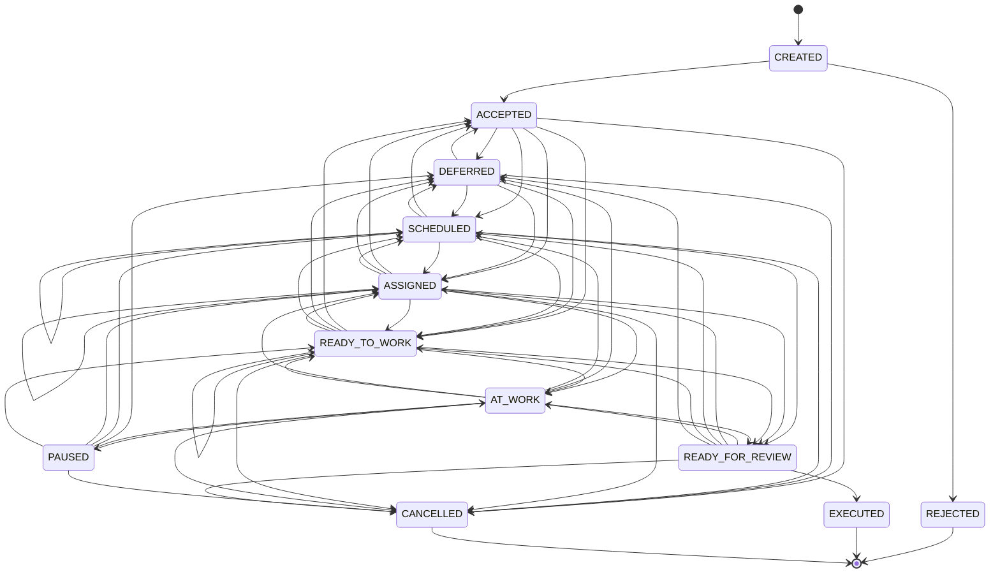

# Workflow Ticket: бизнес-правила, история и граф статусов

## 1. Основная модель

`Ticket` хранит не отдельное поле «текущий статус», а **историю workflow-событий**.

Каждое изменение workflow добавляет новую неизменяемую `TicketStatusRecord`.

```text
SCHEDULED → SCHEDULED
```

означает не update старой плановой даты, а отдельное бизнес-событие:

```text
заявка перепланирована
```

Аналогично:

```text
ASSIGNED → ASSIGNED
```

означает:

```text
исполнитель переназначен
```

Старые status records не редактируются и не удаляются. Любое новое действие добавляет новую запись истории.

Текущий статус определяется последней записью истории:

```text
ticket.current_status() == ticket.statuses[-1].status
```

Порядок истории в persistence определяется `status_id`, а не фактическими датами работы.

---

## 2. Структура `TicketStatusRecord`

Каждая status record содержит:

```text
status_id
actor_employee_id
status
date_created

executor_id

planned_start_at
planned_finish_at

actual_started_at
actual_finished_at

comment
```

Смысл полей:

```text
actor_employee_id
    кто зарегистрировал workflow-событие

executor_id
    кто является исполнителем в данном состоянии
    0 в domain / NULL в SQL означает: исполнителя нет

date_created
    когда запись workflow была создана в системе

planned_start_at / planned_finish_at
    плановые даты

actual_started_at / actual_finished_at
    фактический интервал выполнения работы
```

`date_created` и `actual_*` — разные понятия.

Например, сотрудник может вечером зарегистрировать работу, выполненную утром:

```text
date_created       = 18:00
actual_started_at  = 09:00
actual_finished_at = 10:30
```

---

## 3. Текущий исполнитель

Источник истины о текущем исполнителе — только текущая status record:

```python
ticket.current_executor_id()
```

Он возвращает:

```text
current_status_record.executor_id
```

Нельзя искать «последнего исполнителя в истории».

Пример:

```text
READY_TO_WORK executor_id=20
SCHEDULED     executor_id=0
```

После перехода в `SCHEDULED` текущего исполнителя нет, даже если в старой истории он был.

---

## 4. Статусы Ticket

Текущий набор статусов:

```text
CREATED
REJECTED
ACCEPTED
DEFERRED
SCHEDULED
ASSIGNED
READY_TO_WORK
AT_WORK
PAUSED
READY_FOR_REVIEW
EXECUTED
CANCELLED
```

`OFFLINE_WORK` не является статусом.

Офлайн- или ретроспективно внесённая работа — это способ зарегистрировать фактически завершённую работу переходом сразу в:

```text
READY_FOR_REVIEW
```

---

## 5. Смысл статусов и допустимый payload

### CREATED

Заявка создана, но ещё не признана рабочей.

```text
executor_id          отсутствует
planned_*            отсутствуют
actual_*             отсутствуют
```

Допустимые переходы:

```text
CREATED → ACCEPTED
CREATED → REJECTED
```

---

### REJECTED

Заявка отклонена до принятия в работу.

```text
REJECTED — terminal status
```

Комментарий с причиной обязателен.

```text
executor_id          отсутствует
planned_*            отсутствуют
actual_*             отсутствуют
comment              обязателен
```

---

### ACCEPTED

Заявка признана корректной и может быть обработана.

```text
executor_id          отсутствует
planned_*            отсутствуют
actual_*             отсутствуют
```

Допустимые дальнейшие направления:

```text
ACCEPTED → DEFERRED
ACCEPTED → SCHEDULED
ACCEPTED → ASSIGNED
ACCEPTED → READY_TO_WORK
ACCEPTED → CANCELLED
```

Из `ACCEPTED` нельзя напрямую переходить в `AT_WORK`.

Перед началом онлайн-работы сначала должна появиться запись назначения или готовности к работе:

```text
ACCEPTED
→ ASSIGNED
→ AT_WORK
```

или:

```text
ACCEPTED
→ READY_TO_WORK
→ AT_WORK
```

---

### DEFERRED

Заявка отложена.

Типовые причины:

```text
- нужны данные от клиента;
- нужно согласование;
- нет доступа;
- нужны материалы;
- требуется решение менеджера;
- нужно сменить отдел;
- клиент временно отключён.
```

Комментарий с причиной обязателен.

```text
executor_id          отсутствует
planned_*            отсутствуют
actual_*             отсутствуют
comment              обязателен
```

Допустимые переходы:

```text
DEFERRED → ACCEPTED
DEFERRED → SCHEDULED
DEFERRED → ASSIGNED
DEFERRED → READY_TO_WORK
DEFERRED → CANCELLED
```

---

### SCHEDULED

Заявка запланирована, но исполнитель ещё не назначен.

```text
executor_id          отсутствует
planned_start_at     обязателен
planned_finish_at    опционален
actual_*             отсутствуют
```

Повторный переход:

```text
SCHEDULED → SCHEDULED
```

означает перепланирование.

Желательно требовать комментарий при повторном планировании.

Допустимые переходы:

```text
SCHEDULED → SCHEDULED
SCHEDULED → ACCEPTED
SCHEDULED → DEFERRED
SCHEDULED → ASSIGNED
SCHEDULED → READY_TO_WORK
SCHEDULED → READY_FOR_REVIEW
SCHEDULED → CANCELLED
```

Переход:

```text
SCHEDULED → READY_FOR_REVIEW
```

возможен только как регистрация фактически выполненной работы задним числом.

В новой `READY_FOR_REVIEW` record должны быть указаны:

```text
executor_id
actual_started_at
actual_finished_at
```

---

### ASSIGNED

Назначен ответственный исполнитель.

```text
executor_id          обязателен
planned_*            отсутствуют
actual_*             отсутствуют
```

Повторный переход:

```text
ASSIGNED → ASSIGNED
```

означает переназначение.

Желательно требовать комментарий при повторном назначении.

Допустимые переходы:

```text
ASSIGNED → ASSIGNED
ASSIGNED → ACCEPTED
ASSIGNED → DEFERRED
ASSIGNED → SCHEDULED
ASSIGNED → READY_TO_WORK
ASSIGNED → AT_WORK
ASSIGNED → READY_FOR_REVIEW
ASSIGNED → CANCELLED
```

Переход:

```text
ASSIGNED → READY_FOR_REVIEW
```

возможен только как ретроспективная фиксация завершённой работы.

---

### READY_TO_WORK

Есть и исполнитель, и план выполнения.

```text
executor_id          обязателен
planned_start_at     обязателен
planned_finish_at    опционален
actual_*             отсутствуют
```

Смысл:

```text
конкретный сотрудник должен выполнить работу в запланированный период
```

Повторный переход:

```text
READY_TO_WORK → READY_TO_WORK
```

означает новое назначение с новым планом.

Допустимые переходы:

```text
READY_TO_WORK → READY_TO_WORK
READY_TO_WORK → ACCEPTED
READY_TO_WORK → DEFERRED
READY_TO_WORK → SCHEDULED
READY_TO_WORK → ASSIGNED
READY_TO_WORK → AT_WORK
READY_TO_WORK → READY_FOR_REVIEW
READY_TO_WORK → CANCELLED
```

Переход:

```text
READY_TO_WORK → READY_FOR_REVIEW
```

может означать, что работа была выполнена, но зарегистрирована позже.

В таком случае в новой `READY_FOR_REVIEW` record обязательны:

```text
executor_id
actual_started_at
actual_finished_at
```

---

### AT_WORK

Работа по заявке выполняется в данный момент.

```text
executor_id          обязателен
actual_started_at    обязателен
planned_*            отсутствуют
actual_finished_at   отсутствует
```

При обычном начале работы `actual_started_at` устанавливает система:

```text
actual_started_at = now()
```

Рабочее время в `AT_WORK` считается по истории статусов:

```text
AT_WORK.date_created
    →
дата следующей status record
```

Если `AT_WORK` является текущим статусом:

```text
AT_WORK.date_created
    →
now()
```

Допустимые переходы:

```text
AT_WORK → PAUSED
AT_WORK → READY_FOR_REVIEW

AT_WORK → DEFERRED
AT_WORK → SCHEDULED
AT_WORK → ASSIGNED
AT_WORK → READY_TO_WORK
AT_WORK → CANCELLED
```

Первые два — обычные действия исполнителя.

Остальные переходы — управленческие или аварийные.

---

### PAUSED

Работа начиналась, но временно остановлена.

```text
executor_id          обязателен
planned_*            отсутствуют
actual_*             отсутствуют
```

Отличие от `DEFERRED`:

```text
PAUSED
    внутренняя временная пауза;
    исполнитель сохраняется;
    работа уже была начата.

DEFERRED
    заявка отложена по внешней или управленческой причине;
    текущий исполнитель отсутствует.
```

Допустимые переходы:

```text
PAUSED → AT_WORK

PAUSED → DEFERRED
PAUSED → SCHEDULED
PAUSED → ASSIGNED
PAUSED → READY_TO_WORK
PAUSED → CANCELLED
```

`PAUSED → AT_WORK` — обычное действие текущего исполнителя.

Остальные переходы — управленческие.

---

### READY_FOR_REVIEW

Исполнитель завершил свой этап работы, но результат ещё не подтверждён.

```text
executor_id          обязателен
actual_finished_at   обязателен
```

`READY_FOR_REVIEW` может быть создан двумя разными путями.

#### Онлайн-работа через `AT_WORK`

История:

```text
... → AT_WORK → READY_FOR_REVIEW
```

В `READY_FOR_REVIEW` record:

```text
executor_id
actual_finished_at
actual_started_at = None
```

Начало работы уже отражено предыдущей записью `AT_WORK`.

#### Работа внесена задним числом

История:

```text
SCHEDULED
    → READY_FOR_REVIEW

или

ASSIGNED
    → READY_FOR_REVIEW

или

READY_TO_WORK
    → READY_FOR_REVIEW
```

В `READY_FOR_REVIEW` record обязательны:

```text
executor_id
actual_started_at
actual_finished_at
```

Правило определения способа регистрации работы:

```text
предыдущий статус = AT_WORK
и actual_started_at отсутствует
    → работа велась через онлайн-workflow

предыдущий статус = SCHEDULED / ASSIGNED / READY_TO_WORK
и actual_started_at присутствует
    → работа внесена задним числом
```

Недопустимы сочетания:

```text
AT_WORK → READY_FOR_REVIEW
с новым actual_started_at

SCHEDULED / ASSIGNED / READY_TO_WORK → READY_FOR_REVIEW
без actual_started_at
```

Для ретроспективно зарегистрированной работы:

```text
actual_started_at <= actual_finished_at
actual_started_at не может быть в будущем
actual_finished_at не может быть в будущем
```

Допустимые переходы:

```text
READY_FOR_REVIEW → EXECUTED
READY_FOR_REVIEW → AT_WORK
READY_FOR_REVIEW → ASSIGNED
READY_FOR_REVIEW → SCHEDULED
READY_FOR_REVIEW → READY_TO_WORK
READY_FOR_REVIEW → DEFERRED
READY_FOR_REVIEW → CANCELLED
```

---

### EXECUTED

Работа выполнена и подтверждена.

```text
EXECUTED — terminal status
```

```text
executor_id          отсутствует
planned_*            отсутствуют
actual_*             отсутствуют
```

После `EXECUTED` заявка не изменяется.

---

### CANCELLED

Заявка была принята в работу, но затем снята.

```text
CANCELLED — terminal status
```

Комментарий с причиной обязателен.

```text
executor_id          отсутствует
planned_*            отсутствуют
actual_*             отсутствуют
comment              обязателен
```

Отличие:

```text
REJECTED
    заявка не прошла первичную проверку.

CANCELLED
    заявка была рабочей, но затем снята.
```

---

## 6. Граф статусов

Граф хранится только в `TicketState`.

```text
TicketState
    allowed_next
    terminal
    requires_executor
    requires_planned_start
    work_started
    locks_department_change
```

`Ticket` использует `TicketState` напрямую:

```text
Ticket.can_change_status(...)
    проверяет допустимость перехода без изменения aggregate

Ticket.append_status(...)
    добавляет record только при допустимом переходе
```

Отдельного `TicketWorkflowPolicy` нет.

Общий граф:



---

## 7. Domain services и границы ответственности

### Application Service и RBAC

Application layer отвечает за вопрос:

```text
кто из реальных сотрудников может вызвать use case
```

Например:

```text
может ли сотрудник подтвердить выполненную заявку
может ли сотрудник переназначить исполнителя
может ли сотрудник отключить клиента
```

Эти правила определяются permissions.

Application service не должен хранить граф статусов и не должен напрямую решать, допустим ли переход.

---

### Ticket

`Ticket` отвечает за локальные инварианты aggregate:

```text
- status history существует;
- terminal Ticket не изменяется;
- переход соответствует TicketState;
- current executor определяется текущей status record;
- derived state пересчитывается из истории.
```

---

### TicketManagementService

Управляет обычными административными действиями:

```text
accept
reject
defer
schedule
assign
ready_to_work
cancel
handle_client_disabled
```

---

### TicketExecutionService

Управляет действиями текущего исполнителя:

```text
take_to_work
pause_work
resume_work
submit_for_review
record_completed_work_for_review
```

`record_completed_work_for_review` регистрирует фактически выполненную работу задним числом и создаёт сразу `READY_FOR_REVIEW`.

Он допустим только из:

```text
SCHEDULED
ASSIGNED
READY_TO_WORK
```

---

### TicketReviewService

Управляет этапом review:

```text
confirm_execution
return_to_work
return_to_assigned
return_to_scheduled
return_to_ready_to_work
return_to_deferred
```

Все review-операции выполняются только из:

```text
READY_FOR_REVIEW
```

---

## 8. Обычные действия исполнителя

Исполнитель — это current executor Ticket.

Проверка:

```text
actor_employee_id == ticket.current_executor_id()
```

Исполнитель не определяет судьбу заявки, а фиксирует выполнение своей работы.

Обычные действия исполнителя:

```text
ASSIGNED / READY_TO_WORK
    → AT_WORK

AT_WORK
    → PAUSED

AT_WORK
    → READY_FOR_REVIEW

PAUSED
    → AT_WORK

SCHEDULED / ASSIGNED / READY_TO_WORK
    → READY_FOR_REVIEW
      только через record_completed_work_for_review
```

Исполнитель не может самостоятельно:

```text
- принять или отклонить заявку;
- отложить заявку;
- отменить заявку;
- перепланировать;
- переназначить другого исполнителя;
- сменить department;
- подтвердить EXECUTED.
```

---

## 9. Управленческие и аварийные переходы

Управляющий сотрудник имеет нужное permission в application layer.

Он может выполнять, например:

```text
CREATED → ACCEPTED
CREATED → REJECTED

ACCEPTED / DEFERRED
    → SCHEDULED / ASSIGNED / READY_TO_WORK / CANCELLED

AT_WORK / PAUSED
    → DEFERRED / SCHEDULED / ASSIGNED / READY_TO_WORK / CANCELLED

READY_FOR_REVIEW
    → EXECUTED
    → AT_WORK
    → ASSIGNED
    → SCHEDULED
    → READY_TO_WORK
    → DEFERRED
    → CANCELLED
```

Аварийные случаи:

```text
исполнитель временно недоступен:
AT_WORK → PAUSED

нужен другой исполнитель:
AT_WORK → ASSIGNED

нужно согласование или данные:
AT_WORK → DEFERRED

нужно изменить план:
AT_WORK → SCHEDULED
```

---

## 10. Отключение Client

Отключение клиента — отдельное бизнес-событие.

`ClientApplicationService`:

```text
- проверяет permission;
- отключает Client;
- загружает связанные не-terminal Ticket;
- вызывает TicketManagementService.handle_client_disabled(...);
- сохраняет только изменённые Ticket;
- отключает пользователей клиента.
```

Application service не знает статусный граф.

Правила `handle_client_disabled`:

```text
CREATED
    → REJECTED

ACCEPTED
SCHEDULED
ASSIGNED
READY_TO_WORK
    → DEFERRED

DEFERRED
AT_WORK
PAUSED
READY_FOR_REVIEW
REJECTED
EXECUTED
CANCELLED
    → остаются без изменений
```

Причина должна попасть в `TicketStatusRecord.comment`, например:

```text
Client disabled
```

---

## 11. Department

### Admin и Department

```text
Admin может не иметь department.
Admin может принадлежать одному department.
Admin без department не может быть executor.
Disabled Admin не может быть назначен executor.
```

Исполнитель должен принадлежать тому же department, что и Ticket:

```text
executor.department_id == ticket.department_id
```

Admin нельзя перевести в другой department, пока он является current executor незавершённой заявки.

---

### Ticket и Department

```text
Ticket может не иметь department.
Ticket без department не может получить executor.
Ticket может принадлежать одному department.
```

Проверки существования Admin, Department, их enabled-state и совпадения department относятся к application service или специальной cross-aggregate policy, а не к `Ticket`.

---

## 12. Смена department Ticket

Department можно менять только пока Ticket не находится в состоянии, блокирующем такое изменение.

Разрешены состояния:

```text
CREATED
ACCEPTED
DEFERRED
SCHEDULED
```

В `SCHEDULED` executor отсутствует по определению статуса, поэтому смена department допустима.

Department заблокирован в:

```text
ASSIGNED
READY_TO_WORK
AT_WORK
PAUSED
READY_FOR_REVIEW
REJECTED
EXECUTED
CANCELLED
```

Изменение department не является update старой workflow-record. Это отдельное изменение Ticket root, которое должно пройти application-level проверки.

---

## 13. Requires attention

Не вводим отдельный статус `PROBLEM`.

Вместо этого используется вычисляемый аналитический признак:

```text
requires_attention
```

Он может быть `True`, если:

```text
- Ticket перепланировался;
- исполнитель переназначался;
- фактически выполненная работа внесена задним числом;
- Ticket возвращался из READY_FOR_REVIEW обратно в работу;
- Ticket был в AT_WORK и затем ушёл в DEFERRED / SCHEDULED / ASSIGNED;
- Ticket долго находится в DEFERRED;
- planned_start_at уже прошёл, а Ticket не terminal.
```

Это не workflow-статус и не часть aggregate invariants. Это read-model или аналитический признак.

---

## 14. Предпочтительные backend-операции

UI и API не должны передавать произвольный `change_status`.

Нужны осмысленные use cases:

```text
accept
reject

schedule
reschedule

assign
reassign
ready_to_work

take_to_work
pause_work
resume_work

submit_for_review
record_completed_work_for_review

confirm_execution
return_to_work
return_to_assigned
return_to_scheduled
return_to_ready_to_work
return_to_deferred

defer
cancel

handle_client_disabled
```

Одна UI-кнопка может вызывать orchestration, которая создаёт несколько status records. Но каждая запись истории должна отражать отдельный фактический workflow-шаг.
