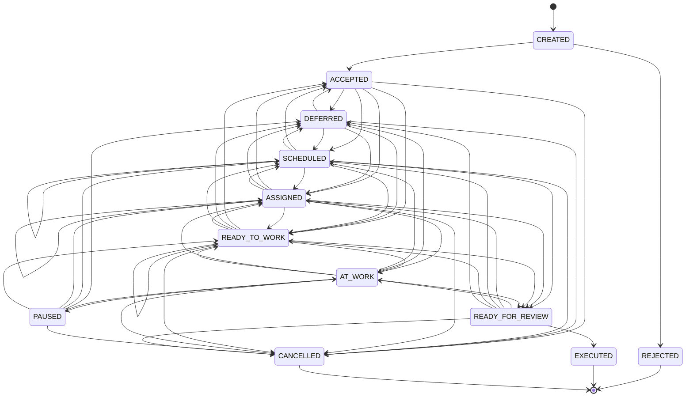
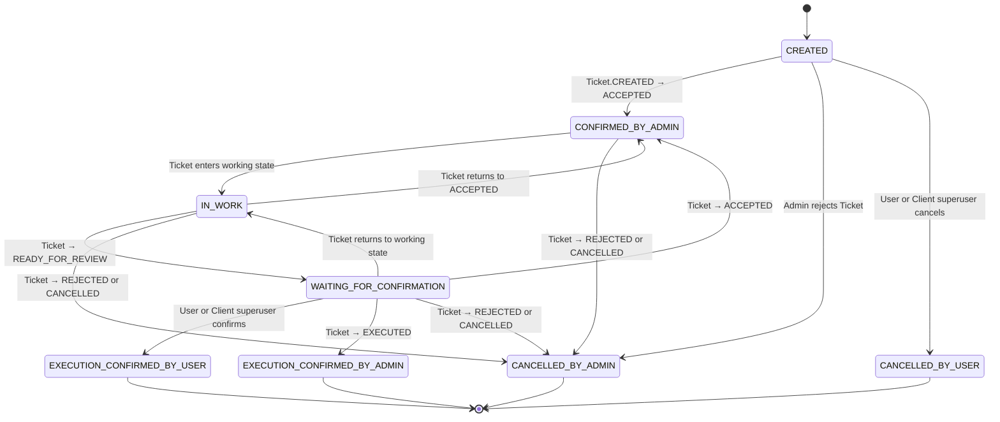

# Workflow Ticket и TicketUser

## Статус документа

Документ объединяет:

- текущий реализованный workflow `Ticket`;
- согласованные правила связи `Ticket` и `TicketUser`;
- целевую модель `TicketUser`;
- изменения, которые потребуются в существующем коде;
- открытые вопросы по пользовательскому снятию заявки.

`Ticket` и `TicketUser` — самостоятельные aggregate с независимыми history records.

---

# 1. Общая модель

## 1.1. Два workflow

```text
Ticket
    Внутренний workflow организации:
    принятие, планирование, назначение, выполнение, review и закрытие.

TicketUser
    Внешний workflow пользовательской заявки:
    создание, принятие организацией, работа, ожидание подтверждения,
    подтверждение результата или снятие заявки.
```

`Ticket` и `TicketUser` не являются двумя представлениями одного aggregate.

Они связаны, но каждый aggregate отвечает за свои инварианты и свою историю.

## 1.2. Границы ответственности

```text
User и superuser Client
    изменяют только TicketUser.

Admin и Executor
    изменяют Ticket через внутренний workflow.

User и superuser Client
    никогда не создают и не изменяют TicketStatusRecord.

Ticket и TicketUser
    не загружают и не изменяют друг друга из domain-кода.

Application service
    координирует изменения Ticket и TicketUser
    в одной транзакции Unit of Work.
```

## 1.3. Связь Ticket и TicketUser

Для связанной пары:

```text
Ticket.user_ticket_id == TicketUser.ticket_id
Ticket.client_id == TicketUser.client_id
```

Целевая связь:

```text
TicketUser 1 ─── 1 Ticket
```

Одна пользовательская заявка не должна иметь две связанные внутренние Ticket.

Для внутренней Ticket без пользовательского workflow:

```text
Ticket.user_ticket_id = 0
```

В SQLite это может храниться как `NULL`.

## 1.4. Снимок данных

При создании связанной пары Ticket получает снимок пользовательских данных.

Минимальный набор:

```text
client_id
user_id
contact_user_id
text_of_ticket
description
urgency_level
```

После создания:

```text
TicketUser и Ticket
не синхронизируют содержимое автоматически.
```

Например:

```text
изменение description в Ticket
    не меняет description в TicketUser;

изменение text_of_ticket в TicketUser
    не меняет text_of_ticket в Ticket.
```

Это исключает необходимость решать, какая сущность является текущим источником истины для одного и того же поля.

---

# 2. Ticket

## 2.1. Основная модель

`Ticket` не хранит отдельное поле текущего статуса как источник истины.

Она хранит append-only историю workflow-событий:

```text
TicketStatusRecord[]
```

Каждое изменение workflow добавляет новую неизменяемую `TicketStatusRecord`.

Например:

```text
SCHEDULED → SCHEDULED
```

означает:

```text
заявка перепланирована.
```

Аналогично:

```text
ASSIGNED → ASSIGNED
```

означает:

```text
исполнитель переназначен.
```

Старые status records не редактируются и не удаляются.

Текущий статус определяется последней записью истории:

```python
ticket.current_status() == ticket.statuses[-1].status
```

Порядок workflow history в persistence определяется `status_id`, а не фактическим временем выполнения работы.

---

## 2.2. TicketStatusRecord

Каждая status record содержит:

```text
status_id
actor_employee_id
status
date_created

executor_id

planned_start_at
planned_finish_at

actual_started_at
actual_finished_at

comment
```

### Значение полей

```text
actor_employee_id
    Кто зарегистрировал workflow-событие.

executor_id
    Кто является исполнителем в данном состоянии.

date_created
    Когда workflow-record создана в системе.

planned_start_at / planned_finish_at
    Плановый интервал работы.

actual_started_at / actual_finished_at
    Фактический интервал выполнения работы.

comment
    Пояснение к конкретному workflow-событию.
```

### Системный actor

В domain-модели:

```text
actor_employee_id = 0
```

означает:

```text
системное действие;
не User;
не Admin;
не Executor.
```

В SQLite:

```text
actor_employee_id = 0 в domain
    ↔
actor_employee_id = NULL в базе данных.
```

`0` не означает неизвестного автора.

```text
0 == SYSTEM_GENERATED
```

На текущем этапе это нужно для автоматического создания Ticket на основании TicketUser.

Для ручных действий:

```text
actor_employee_id > 0
```

и содержит id реального Admin или Executor.

### Отсутствующий исполнитель

В domain-модели:

```text
executor_id = 0
```

означает отсутствие исполнителя.

В SQLite:

```text
executor_id = NULL
```

Пример:

```text
READY_TO_WORK executor_id=20
SCHEDULED     executor_id=0
```

После перехода в `SCHEDULED` текущего исполнителя нет, даже если он был указан в более ранних status records.

### Дата регистрации и фактические даты

`date_created` и `actual_*` — разные понятия.

Например:

```text
date_created       = 18:00
actual_started_at  = 09:00
actual_finished_at = 10:30
```

Это означает, что работа была выполнена утром, но зарегистрирована в системе вечером.

---

## 2.3. Root-поля Ticket и происхождение заявки

Для Ticket, автоматически созданной на основании TicketUser:

```text
Ticket.admin_id = 0
Ticket.user_ticket_id = TicketUser.ticket_id
Ticket.CREATED.actor_employee_id = 0
```

В SQLite:

```text
tickets.admin_id = NULL
ticket_status_records.actor_employee_id = NULL
```

После принятия заявки Admin:

```text
Ticket.CREATED → ACCEPTED
```

в root Ticket сохраняется Admin, принявший заявку:

```text
Ticket.admin_id = accepting_admin_id
```

В истории появляется:

```text
TicketStatusRecord(
    status=ACCEPTED,
    actor_employee_id=accepting_admin_id,
)
```

`Ticket.admin_id` не заменяет workflow history.

Источником аудита принятия остаётся `TicketStatusRecord`.

---

## 2.4. Сценарии создания Ticket и TicketUser

### User создаёт TicketUser

Когда User создаёт TicketUser, в той же транзакции автоматически создаётся связанная Ticket.

Начальное состояние пары:

| Aggregate | Начальный статус | Actor initial record |
|---|---|---:|
| `TicketUser` | `CREATED` | id User |
| `Ticket` | `CREATED` | `0`, системное создание |

Для Ticket:

```text
admin_id = 0
user_ticket_id = TicketUser.ticket_id
```

Ticket получает снимок данных TicketUser.

### Admin принимает TicketUser

Admin принимает существующую пару:

```text
TicketUser.CREATED → CONFIRMED_BY_ADMIN
Ticket.CREATED     → ACCEPTED
```

Оба перехода выполняются одной application-service операцией и в одной транзакции.

В history обеих aggregate записывается реальный Admin:

```text
TicketUserStatusRecord(
    status=CONFIRMED_BY_ADMIN,
    actor_employee_id=admin_id,
)

TicketStatusRecord(
    status=ACCEPTED,
    actor_employee_id=admin_id,
)
```

Одновременно:

```text
Ticket.admin_id = admin_id
```

### Admin создаёт Ticket для конкретного User

Если Admin создаёт Ticket с:

```text
user_id != 0
```

то в той же транзакции автоматически создаётся связанная TicketUser в состоянии:

```text
CONFIRMED_BY_ADMIN
```

Существующий `Ticket.create()` создаёт Ticket в состоянии `CREATED`.

Поэтому application service должна в той же транзакции выполнить обычный переход:

```text
Ticket.CREATED → ACCEPTED
```

Итоговое состояние после commit:

```text
Ticket.ACCEPTED
TicketUser.CONFIRMED_BY_ADMIN
```

История Ticket при этом честно сохраняет два события:

```text
Ticket.CREATED
Ticket.ACCEPTED
```

Actor обеих Ticket records — Admin, который создал и принял заявку.

Для TicketUser создаётся initial record:

```text
TicketUserStatusRecord(
    status=CONFIRMED_BY_ADMIN,
    actor_employee_id=admin_id,
)
```

`TicketUser.CREATED` в этом сценарии не создаётся, потому что User не подавал заявку самостоятельно.

Инвариант:

```text
Ticket.user_id != 0
    → существует связанная TicketUser.
```

### Внутренняя Ticket без User

Если Admin создаёт Ticket с:

```text
user_id = 0
```

то TicketUser не создаётся.

Такая Ticket существует только во внутреннем workflow.

---

## 2.5. Текущий исполнитель

Источник истины о текущем исполнителе — только текущая status record:

```python
ticket.current_executor_id()
```

Она возвращает:

```text
ticket.current_status_record().executor_id
```

Нельзя искать последнего исполнителя по всей истории.

---

## 2.6. Статусы Ticket

```text
CREATED
REJECTED
ACCEPTED
DEFERRED
SCHEDULED
ASSIGNED
READY_TO_WORK
AT_WORK
PAUSED
READY_FOR_REVIEW
EXECUTED
CANCELLED
```

`OFFLINE_WORK` не является статусом.

Ретроспективно внесённая работа — это отдельный способ создать `READY_FOR_REVIEW` record с фактическим интервалом работы.

---

## 2.7. Статусы Ticket и допустимый payload

### CREATED

Ticket создана, но ещё не принята в работу.

Для Ticket, созданной из TicketUser:

```text
actor_employee_id = 0
admin_id = 0
user_ticket_id обязателен
```

Payload:

```text
executor_id          отсутствует
planned_*            отсутствуют
actual_*             отсутствуют
```

Допустимые переходы:

```text
CREATED → ACCEPTED
CREATED → REJECTED
```

### REJECTED

Ticket отклонена до принятия в работу.

```text
REJECTED — terminal status
```

Payload:

```text
executor_id          отсутствует
planned_*            отсутствуют
actual_*             отсутствуют
comment              обязателен
actor_employee_id    реальный Admin
```

`REJECTED` означает административное отклонение заявки.

Для связанной активной TicketUser:

```text
Ticket.REJECTED
    → TicketUser.CANCELLED_BY_ADMIN
```

### ACCEPTED

Ticket признана корректной и принята в работу.

Payload:

```text
executor_id          отсутствует
planned_*            отсутствуют
actual_*             отсутствуют
```

Допустимые переходы:

```text
ACCEPTED → DEFERRED
ACCEPTED → SCHEDULED
ACCEPTED → ASSIGNED
ACCEPTED → READY_TO_WORK
ACCEPTED → CANCELLED
```

Из `ACCEPTED` нельзя напрямую перейти в `AT_WORK`.

Перед началом online-работы должна появиться запись назначения или готовности:

```text
ACCEPTED
→ ASSIGNED
→ AT_WORK
```

или:

```text
ACCEPTED
→ READY_TO_WORK
→ AT_WORK
```

### DEFERRED

Ticket отложена.

Типовые причины:

```text
- нужны данные от клиента;
- нужно согласование;
- нет доступа;
- нужны материалы;
- требуется решение менеджера;
- нужно сменить department;
- Client временно отключён.
```

Payload:

```text
executor_id          отсутствует
planned_*            отсутствуют
actual_*             отсутствуют
comment              обязателен
```

Допустимые переходы:

```text
DEFERRED → ACCEPTED
DEFERRED → SCHEDULED
DEFERRED → ASSIGNED
DEFERRED → READY_TO_WORK
DEFERRED → CANCELLED
```

### SCHEDULED

Ticket запланирована, но исполнитель ещё не назначен.

Payload:

```text
executor_id          отсутствует
planned_start_at     обязателен
planned_finish_at    опционален
actual_*             отсутствуют
```

Повторный переход:

```text
SCHEDULED → SCHEDULED
```

означает перепланирование.

Допустимые переходы:

```text
SCHEDULED → SCHEDULED
SCHEDULED → ACCEPTED
SCHEDULED → DEFERRED
SCHEDULED → ASSIGNED
SCHEDULED → READY_TO_WORK
SCHEDULED → READY_FOR_REVIEW
SCHEDULED → CANCELLED
```

Переход:

```text
SCHEDULED → READY_FOR_REVIEW
```

возможен только как ретроспективная регистрация завершённой работы.

В новой `READY_FOR_REVIEW` record обязательны:

```text
executor_id
actual_started_at
actual_finished_at
```

### ASSIGNED

Назначен ответственный исполнитель.

Payload:

```text
executor_id          обязателен
planned_*            отсутствуют
actual_*             отсутствуют
```

Повторный переход:

```text
ASSIGNED → ASSIGNED
```

означает переназначение.

Допустимые переходы:

```text
ASSIGNED → ASSIGNED
ASSIGNED → ACCEPTED
ASSIGNED → DEFERRED
ASSIGNED → SCHEDULED
ASSIGNED → READY_TO_WORK
ASSIGNED → AT_WORK
ASSIGNED → READY_FOR_REVIEW
ASSIGNED → CANCELLED
```

Переход:

```text
ASSIGNED → READY_FOR_REVIEW
```

возможен только как ретроспективная фиксация завершённой работы.

### READY_TO_WORK

Определены исполнитель и план работы.

Payload:

```text
executor_id          обязателен
planned_start_at     обязателен
planned_finish_at    опционален
actual_*             отсутствуют
```

Повторный переход:

```text
READY_TO_WORK → READY_TO_WORK
```

означает новое назначение с новым планом.

Допустимые переходы:

```text
READY_TO_WORK → READY_TO_WORK
READY_TO_WORK → ACCEPTED
READY_TO_WORK → DEFERRED
READY_TO_WORK → SCHEDULED
READY_TO_WORK → ASSIGNED
READY_TO_WORK → AT_WORK
READY_TO_WORK → READY_FOR_REVIEW
READY_TO_WORK → CANCELLED
```

Переход в `READY_FOR_REVIEW` означает ретроспективную фиксацию выполненной работы.

### AT_WORK

Работа выполняется в данный момент.

Payload:

```text
executor_id          обязателен
actual_started_at    обязателен
actual_finished_at   отсутствует
planned_*            отсутствуют
```

При обычном начале работы:

```text
actual_started_at = now()
```

Рабочее время в online workflow определяется по истории:

```text
AT_WORK record
    →
следующая status record
```

Если `AT_WORK` является текущим статусом:

```text
AT_WORK record
    →
now()
```

Допустимые переходы:

```text
AT_WORK → PAUSED
AT_WORK → READY_FOR_REVIEW

AT_WORK → DEFERRED
AT_WORK → SCHEDULED
AT_WORK → ASSIGNED
AT_WORK → READY_TO_WORK
AT_WORK → CANCELLED
```

Первые два перехода — обычные действия current executor.

Остальные — управленческие или аварийные действия.

### PAUSED

Работа началась, но временно остановлена.

Payload:

```text
executor_id          обязателен
planned_*            отсутствуют
actual_*             отсутствуют
```

Отличие от `DEFERRED`:

```text
PAUSED
    внутренняя временная пауза;
    исполнитель сохраняется;
    работа уже была начата.

DEFERRED
    заявка отложена по внешней или управленческой причине;
    текущий исполнитель отсутствует.
```

Допустимые переходы:

```text
PAUSED → AT_WORK

PAUSED → DEFERRED
PAUSED → SCHEDULED
PAUSED → ASSIGNED
PAUSED → READY_TO_WORK
PAUSED → CANCELLED
```

### READY_FOR_REVIEW

Исполнитель завершил этап работы, но внутренний workflow ещё не завершён.

Payload:

```text
executor_id          обязателен
actual_finished_at   обязателен
```

`READY_FOR_REVIEW` создаётся двумя путями.

#### Online workflow через AT_WORK

История:

```text
... → AT_WORK → READY_FOR_REVIEW
```

В новой record:

```text
executor_id
actual_finished_at
actual_started_at = None
```

Начало работы уже отражено предыдущей `AT_WORK` record.

#### Ретроспективная регистрация работы

История:

```text
SCHEDULED
    → READY_FOR_REVIEW

или

ASSIGNED
    → READY_FOR_REVIEW

или

READY_TO_WORK
    → READY_FOR_REVIEW
```

В новой record обязательны:

```text
executor_id
actual_started_at
actual_finished_at
```

Правило:

```text
предыдущий статус = AT_WORK
и actual_started_at отсутствует
    → online workflow.

предыдущий статус = SCHEDULED / ASSIGNED / READY_TO_WORK
и actual_started_at присутствует
    → ретроспективная регистрация.
```

Недопустимы:

```text
AT_WORK → READY_FOR_REVIEW
с новым actual_started_at.

SCHEDULED / ASSIGNED / READY_TO_WORK → READY_FOR_REVIEW
без actual_started_at.
```

Для ретроспективной работы:

```text
actual_started_at <= actual_finished_at
actual_started_at не может быть в будущем
actual_finished_at не может быть в будущем
```

Допустимые переходы:

```text
READY_FOR_REVIEW → EXECUTED
READY_FOR_REVIEW → AT_WORK
READY_FOR_REVIEW → ASSIGNED
READY_FOR_REVIEW → SCHEDULED
READY_FOR_REVIEW → READY_TO_WORK
READY_FOR_REVIEW → DEFERRED
READY_FOR_REVIEW → CANCELLED
```

### EXECUTED

Работа выполнена и внутренне подтверждена Admin.

```text
EXECUTED — terminal status
```

Payload:

```text
executor_id          отсутствует
planned_*            отсутствуют
actual_*             отсутствуют
```

После `EXECUTED` Ticket не изменяется.

Для связанной TicketUser:

```text
TicketUser.WAITING_FOR_CONFIRMATION
    → EXECUTION_CONFIRMED_BY_ADMIN
```

Но если TicketUser уже находится в:

```text
EXECUTION_CONFIRMED_BY_USER
```

она остаётся в этом состоянии.

### CANCELLED

Ticket снята после принятия в работу.

```text
CANCELLED — terminal status
```

Для ручной административной отмены:

```text
executor_id          отсутствует
planned_*            отсутствуют
actual_*             отсутствуют
comment              обязателен
actor_employee_id    реальный Admin
```

Отличие:

```text
REJECTED
    Ticket отклонена до принятия.

CANCELLED
    Ticket была принята в работу, но затем снята.
```

Для связанной активной TicketUser:

```text
Ticket.CANCELLED
    → TicketUser.CANCELLED_BY_ADMIN
```

Если TicketUser уже находится в:

```text
EXECUTION_CONFIRMED_BY_USER
```

то дальнейшая отмена Ticket не переписывает этот terminal status.

---

## 2.8. Terminal Ticket

Для terminal Ticket:

```text
REJECTED
EXECUTED
CANCELLED
```

запрещены:

```text
- новые workflow transitions;
- изменение text_of_ticket;
- изменение description;
- изменение department;
- добавление обычных комментариев.
```

`is_closed` — derived-состояние. Оно определяется текущим terminal status.

---

## 2.9. Граф статусов Ticket

Граф хранится только в `TicketState`.

```text
TicketState
    allowed_next
    terminal
    requires_executor
    requires_planned_start
    work_started
    locks_department_change
```

`Ticket` использует `TicketState` напрямую:

```text
Ticket.can_change_status(...)
    проверяет допустимость перехода без изменения aggregate.

Ticket.append_status(...)
    добавляет record только при допустимом переходе.
```

Отдельного `TicketWorkflowPolicy` нет.



---

## 2.10. Domain services и application services

### Application layer и RBAC

Application layer отвечает на вопрос:

```text
кто из реальных сотрудников может вызвать use case.
```

Например:

```text
может ли сотрудник принять TicketUser;
может ли сотрудник назначить исполнителя;
может ли сотрудник подтвердить Ticket;
может ли User подтвердить TicketUser;
может ли superuser Client снять TicketUser.
```

Application service не хранит граф статусов и не определяет допустимость workflow transition.

Текущая реализация использует общие permissions:

```text
AdminPermission.TICKET_OPERATION
AdminPermission.TICKET_VIEW
```

Проверки расположены прямо в application use cases.

Позже их можно заменить детализированными permissions без изменения domain workflow.

### Ticket

`Ticket` отвечает за локальные инварианты:

```text
- history существует;
- terminal Ticket не изменяется;
- переход соответствует TicketState;
- current executor определяется текущей status record;
- derived state пересчитывается из history.
```

### TicketManagementService

Управляет обычными административными действиями:

```text
accept
reject
defer
schedule
assign
ready_to_work
cancel
handle_client_disabled
```

### TicketExecutionService

Управляет действиями current executor:

```text
take_to_work
pause_work
resume_work
submit_for_review
record_completed_work_for_review
```

`record_completed_work_for_review` создаёт `READY_FOR_REVIEW` сразу и допустим только из:

```text
SCHEDULED
ASSIGNED
READY_TO_WORK
```

### TicketReviewService

Управляет этапом review:

```text
confirm_execution
return_to_work
return_to_assigned
return_to_scheduled
return_to_ready_to_work
return_to_deferred
```

Все review-операции доступны только из:

```text
READY_FOR_REVIEW
```

---

## 2.11. Действия исполнителя

Исполнитель — current executor Ticket.

Проверка:

```text
actor_employee_id == ticket.current_executor_id()
```

Обычные действия исполнителя:

```text
ASSIGNED / READY_TO_WORK
    → AT_WORK

AT_WORK
    → PAUSED

AT_WORK
    → READY_FOR_REVIEW

PAUSED
    → AT_WORK

SCHEDULED / ASSIGNED / READY_TO_WORK
    → READY_FOR_REVIEW
      только через record_completed_work_for_review
```

Исполнитель не может самостоятельно:

```text
- принять или отклонить Ticket;
- отменить Ticket;
- отложить Ticket;
- перепланировать;
- переназначить исполнителя;
- сменить department;
- перевести Ticket в EXECUTED.
```

---

## 2.12. Department

### Admin и Department

```text
Admin может не иметь department.
Admin может принадлежать одному department.
Admin без department не может быть executor.
Disabled Admin не может быть назначен executor.
```

Исполнитель должен принадлежать department Ticket:

```text
executor.department_id == ticket.department_id
```

### Ticket и Department

```text
Ticket может не иметь department.
Ticket без department не может получить executor.
Ticket может принадлежать одному department.
```

Проверки существования Admin и Department, их enabled-state и совпадения department выполняются application layer или отдельной cross-aggregate policy.

### Смена department Ticket

Department можно менять только в состояниях:

```text
CREATED
ACCEPTED
DEFERRED
SCHEDULED
```

Department заблокирован в:

```text
ASSIGNED
READY_TO_WORK
AT_WORK
PAUSED
READY_FOR_REVIEW
REJECTED
EXECUTED
CANCELLED
```

Смена department — изменение Ticket root, а не изменение workflow history.

---

## 2.13. Отключение Client

Отключение Client — отдельное бизнес-событие.

`ClientApplicationService`:

```text
- проверяет permission;
- отключает Client;
- загружает связанные non-terminal Ticket;
- вызывает TicketManagementService.handle_client_disabled(...);
- сохраняет только изменённые Ticket;
- отключает пользователей Client.
```

Правила:

```text
CREATED
    → REJECTED

ACCEPTED
SCHEDULED
ASSIGNED
READY_TO_WORK
    → DEFERRED

DEFERRED
AT_WORK
PAUSED
READY_FOR_REVIEW
REJECTED
EXECUTED
CANCELLED
    → остаются без изменений
```

Причину передаёт вызывающий use case.

Она сохраняется в:

```text
TicketStatusRecord.comment
```

---

## 2.14. Requires attention

Не вводится отдельный workflow-статус `PROBLEM`.

Вместо него используется аналитический признак:

```text
requires_attention
```

Он может быть `True`, если:

```text
- Ticket перепланировалась;
- исполнитель переназначался;
- работа внесена задним числом;
- Ticket возвращалась из READY_FOR_REVIEW обратно в работу;
- Ticket была в AT_WORK и затем перешла в DEFERRED / SCHEDULED / ASSIGNED;
- Ticket долго находится в DEFERRED;
- planned_start_at уже прошло, а Ticket не terminal.
```

Это read-model или аналитический признак, а не workflow status и не aggregate invariant.

---

# 3. TicketUser

## 3.1. Статусы TicketUser

```text
CREATED
CONFIRMED_BY_ADMIN
IN_WORK
WAITING_FOR_CONFIRMATION

EXECUTION_CONFIRMED_BY_USER
EXECUTION_CONFIRMED_BY_ADMIN

CANCELLED_BY_USER
CANCELLED_BY_ADMIN
```

Terminal-статусы:

```text
EXECUTION_CONFIRMED_BY_USER
EXECUTION_CONFIRMED_BY_ADMIN
CANCELLED_BY_USER
CANCELLED_BY_ADMIN
```

| Код | Отображение | Terminal | Смысл |
|---|---|:---:|---|
| `CREATED` | Создана | Нет | User создал заявку; связанная Ticket ждёт принятия Admin. |
| `CONFIRMED_BY_ADMIN` | Подтверждена админом | Нет | Admin принял заявку; Ticket находится в `ACCEPTED`. |
| `IN_WORK` | В работе | Нет | Ticket находится в рабочем или организационном состоянии. |
| `WAITING_FOR_CONFIRMATION` | Ожидает подтверждения | Нет | Ticket находится в `READY_FOR_REVIEW`. |
| `EXECUTION_CONFIRMED_BY_USER` | Выполнение подтверждено пользователем | Да | Автор TicketUser или superuser Client подтвердил результат. |
| `EXECUTION_CONFIRMED_BY_ADMIN` | Выполнение подтверждено админом | Да | Admin перевёл Ticket в `EXECUTED`, не ожидая User. |
| `CANCELLED_BY_USER` | Снята пользователем | Да | Заявка снята User или superuser Client. |
| `CANCELLED_BY_ADMIN` | Снята админом | Да | Admin отклонил заявку либо Ticket была отклонена или отменена Admin. |

---

## 3.2. Прямое соответствие Ticket → TicketUser

Соответствие действует, пока TicketUser не находится в terminal-статусе.

| Состояние Ticket | Состояние TicketUser |
|---|---|
| `CREATED` | `CREATED` |
| `ACCEPTED` | `CONFIRMED_BY_ADMIN` |
| `DEFERRED` | `IN_WORK` |
| `SCHEDULED` | `IN_WORK` |
| `ASSIGNED` | `IN_WORK` |
| `READY_TO_WORK` | `IN_WORK` |
| `AT_WORK` | `IN_WORK` |
| `PAUSED` | `IN_WORK` |
| `READY_FOR_REVIEW` | `WAITING_FOR_CONFIRMATION` |
| `EXECUTED` | `EXECUTION_CONFIRMED_BY_ADMIN` |
| `REJECTED` | `CANCELLED_BY_ADMIN` |
| `CANCELLED` | `CANCELLED_BY_ADMIN` |

Для Ticket без связанной TicketUser эта таблица не применяется.

Прямая синхронизация означает:

```text
AT_WORK → DEFERRED → ACCEPTED
```

даёт:

```text
IN_WORK → IN_WORK → CONFIRMED_BY_ADMIN
```

История TicketUser отражает внешнее состояние заявки, а не непрерывность внутренней работы Ticket.

---

## 3.3. Подтверждение выполнения

Когда Ticket достигает review:

```text
Ticket.READY_FOR_REVIEW
    → TicketUser.WAITING_FOR_CONFIRMATION
```

Дальше существуют два независимых пути.

### Подтверждение User или superuser Client

```text
TicketUser.WAITING_FOR_CONFIRMATION
    → EXECUTION_CONFIRMED_BY_USER
```

Подтвердить могут:

```text
автор TicketUser;
superuser того же Client.
```

Ticket при этом не изменяется:

```text
Ticket остаётся READY_FOR_REVIEW.
```

User и superuser Client не создают `TicketStatusRecord`.

### Подтверждение Admin

Admin может не ждать User и завершить Ticket:

```text
Ticket.READY_FOR_REVIEW
    → Ticket.EXECUTED
```

В той же транзакции:

```text
TicketUser.WAITING_FOR_CONFIRMATION
    → EXECUTION_CONFIRMED_BY_ADMIN
```

Actor TicketUser status record — Admin, завершивший Ticket.

### Подтверждение User не переписывается

Если TicketUser уже находится в:

```text
EXECUTION_CONFIRMED_BY_USER
```

то дальнейшие действия с Ticket не меняют это terminal-состояние.

| Новое состояние Ticket | Результат для TicketUser |
|---|---|
| `EXECUTED` | Остаётся `EXECUTION_CONFIRMED_BY_USER`. |
| Рабочий статус после возврата из review | Остаётся `EXECUTION_CONFIRMED_BY_USER`. |
| `READY_FOR_REVIEW` повторно | Остаётся `EXECUTION_CONFIRMED_BY_USER`. |
| `REJECTED` | Остаётся `EXECUTION_CONFIRMED_BY_USER`. |
| `CANCELLED` | Остаётся `EXECUTION_CONFIRMED_BY_USER`. |

`EXECUTION_CONFIRMED_BY_USER` — исторически состоявшийся факт пользовательского подтверждения.

Внутренний workflow Ticket его не переписывает.

---

## 3.4. Граф TicketUser



---

## 3.5. Отклонение заявки Admin

Admin может отклонить заявку, пока пара находится в состоянии:

```text
TicketUser.CREATED
Ticket.CREATED
```

В одной транзакции:

```text
TicketUser.CREATED → CANCELLED_BY_ADMIN
Ticket.CREATED     → REJECTED
```

Комментарий обязателен, потому что `Ticket.REJECTED` требует обоснования.

Actor обеих history records:

```text
реальный Admin, выполнивший отклонение.
```

---

## 3.6. Снятие TicketUser User или superuser Client

`CANCELLED_BY_USER` — terminal status TicketUser.

Минимально согласованное правило:

```text
TicketUser.CREATED
    → CANCELLED_BY_USER
```

Такое действие может выполнить:

```text
автор TicketUser;
superuser того же Client.
```

Комментарий со стороны User необязателен.

User и superuser Client не создают `TicketStatusRecord`.

Точная coordinated-логика для связанной Ticket ещё должна быть закреплена отдельно.

Открытые вопросы:

```text
- должна ли Ticket.CREATED перейти в CANCELLED;
- нужно ли добавить переход Ticket.CREATED → CANCELLED;
- какая запись должна появиться в Ticket history;
- должен ли actor_employee_id этой записи быть равен 0;
- может ли Ticket comment быть пустым;
- допускается ли User cancellation после Ticket.ACCEPTED;
- как исключить расхождение между TicketUser и Ticket
  при конкурентных действиях User и Admin.
```

При реализации нельзя использовать захардкоренный технический комментарий вместо реальной причины снятия заявки.

---

# 4. Application services для связанной пары

## 4.1. Создание TicketUser User

Целевой use case:

```text
create_ticket_user(...)
```

В одной транзакции он:

```text
1. Создаёт TicketUser.CREATED
   с actor_employee_id реального User.

2. Создаёт Ticket.CREATED
   с actor_employee_id = 0.

3. Связывает Ticket.user_ticket_id
   с TicketUser.ticket_id.

4. Сохраняет снимок пользовательских полей в Ticket.
```

## 4.2. Принятие TicketUser Admin

Целевой use case:

```text
accept_ticket_user(ticket_user_id, actor_admin_id)
```

В одной транзакции он:

```text
1. Проверяет права Admin.

2. Загружает TicketUser.

3. Проверяет:
   TicketUser.current_status == CREATED.

4. Загружает связанную Ticket по user_ticket_id.

5. Проверяет:
   Ticket.current_status == CREATED;
   Ticket.client_id == TicketUser.client_id;
   Ticket.user_ticket_id == TicketUser.ticket_id.

6. Выполняет domain-переходы:
   Ticket.CREATED → ACCEPTED;
   TicketUser.CREATED → CONFIRMED_BY_ADMIN.

7. Устанавливает Ticket.admin_id = actor_admin_id.

8. Сохраняет обе aggregate.

9. Commit общей транзакции.
```

`Ticket` и `TicketUser` не должны вызывать друг друга напрямую.

Координация принадлежит application layer.

## 4.3. Изменение Ticket с привязанной TicketUser

Когда application use case меняет Ticket, он должен учитывать:

```text
Ticket.user_ticket_id != 0
```

Если связанная TicketUser существует и не terminal, application layer синхронизирует её статус по таблице соответствия.

Это выполняется в той же Unit of Work транзакции.

Для этого не нужен event bus, asynchronous processing или отдельная saga.

---

# 5. Изменения в существующем коде

## 5.1. TicketStatusRecord

Текущая валидация должна быть расширена так, чтобы:

```text
actor_employee_id > 0
    для ручных workflow-событий.

actor_employee_id = 0
    только для явно системного события.
```

На данном этапе согласованный системный случай:

```text
автоматическое создание Ticket из TicketUser.
```

Persistence mapper должен поддерживать преобразование:

```text
0 в domain
    ↔
NULL в SQLite.
```

## 5.2. Ticket.admin_id

Для Ticket, автоматически созданной из TicketUser:

```text
admin_id = 0 в domain
admin_id = NULL в SQLite.
```

После принятия заявки Admin:

```text
admin_id = id Admin, принявшего Ticket.
```

## 5.3. Ticket.create

Существующий `Ticket.create()` создаёт Ticket в состоянии `CREATED`.

Это остаётся корректным.

Для сценария:

```text
Admin создаёт Ticket для User
```

application service должна создать Ticket, затем сразу провести обычный переход:

```text
CREATED → ACCEPTED
```

в той же транзакции.

## 5.4. TicketUser

Новая модель TicketUser должна заменить старый ограниченный набор статусов пользовательской заявки.

Потребуются:

```text
- новый enum статусов;
- история TicketUserStatusRecord;
- terminal-state правила;
- repository;
- mapper;
- schema;
- application use cases;
- интеграция с Ticket application services.
```

---

# 6. Предпочтительные backend-операции

UI и API не должны передавать произвольный:

```text
change_status
```

Нужны осмысленные use cases.

## Ticket

```text
accept
reject

schedule
reschedule

assign
reassign
ready_to_work

take_to_work
pause_work
resume_work

submit_for_review
record_completed_work_for_review

confirm_execution
return_to_work
return_to_assigned
return_to_scheduled
return_to_ready_to_work
return_to_deferred

defer
cancel

handle_client_disabled
```

## TicketUser

```text
create_ticket_user
accept_ticket_user
reject_ticket_user

confirm_execution_by_user
confirm_execution_by_superuser

cancel_ticket_user
```

Одна UI-команда может координировать изменение двух aggregate, но каждая history record должна отражать отдельный фактический workflow-шаг.