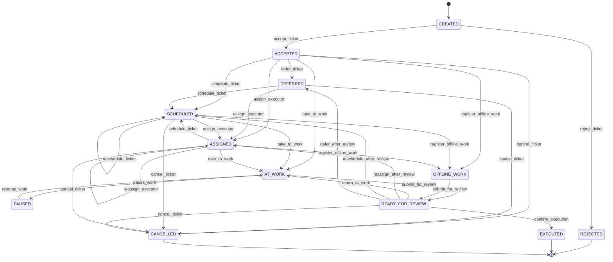
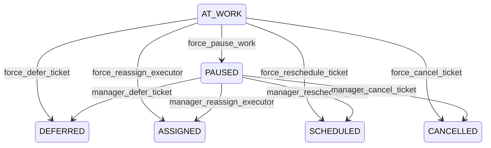

# Workflow Ticket: бизнес-правила и граф статусов

## 1. Основная идея

Заявка хранит не просто текущий статус, а **историю workflow-событий**.

Каждая новая запись статуса — это бизнес-событие.

Например:

```text
SCHEDULED -> SCHEDULED
```

означает не просто “изменили дату”, а:

```text
заявку перепланировали
```

А:

```text
ASSIGNED -> ASSIGNED
```

означает:

```text
исполнителя переназначили
```

Старые записи истории не редактируются. Новое действие добавляет новую запись.

---

## 2. Статусы Ticket

Текущий набор статусов:

```text
CREATED
REJECTED
ACCEPTED
DEFERRED
SCHEDULED
ASSIGNED
AT_WORK
PAUSED
OFFLINE_WORK
READY_FOR_REVIEW
EXECUTED
CANCELLED
```

---

## 3. Смысл статусов

### CREATED

Заявка создана, но ещё не подтверждена как корректная.

Это может быть заявка, которую создал технический сотрудник, первая линия или внешний пользователь.

Из `CREATED` возможны переходы:

```text
CREATED -> ACCEPTED
CREATED -> REJECTED
```

Из `CREATED` нельзя назначать исполнителя, брать заявку в работу или выполнять её.

---

### REJECTED

Заявка отклонена до принятия.

Это конечный статус.

Смысл:

```text
Заявка была создана, но не прошла проверку и не стала рабочей заявкой.
```

После `REJECTED` заявка больше не изменяется.

---

### ACCEPTED

Заявка рассмотрена и признана корректной.

С этого момента она считается полноценной рабочей заявкой.

Возможные переходы:

```text
ACCEPTED -> DEFERRED
ACCEPTED -> SCHEDULED
ACCEPTED -> ASSIGNED
ACCEPTED -> AT_WORK
ACCEPTED -> OFFLINE_WORK
ACCEPTED -> CANCELLED
```

Переход `ACCEPTED -> AT_WORK` может быть высокоуровневой backend-операцией, которая автоматически создаёт промежуточную запись `ASSIGNED`.

---

### DEFERRED

Заявка отложена.

Смысл:

```text
Работа по заявке сейчас невозможна или нецелесообразна.
```

Причины:

```text
- нужны данные от клиента;
- нужно согласование;
- нет доступа;
- нужны материалы;
- нужно управленческое решение;
- выяснилось, что нужен другой отдел.
```

Возможные переходы:

```text
DEFERRED -> SCHEDULED
DEFERRED -> ASSIGNED
DEFERRED -> CANCELLED
```

---

### SCHEDULED

Заявка запланирована.

Обязательно должна быть указана предварительная дата выполнения.

Исполнитель может быть назначен, а может быть не назначен.

Смысл:

```text
Есть план, когда заявкой будут заниматься.
```

Повторный `SCHEDULED` означает:

```text
заявка перепланирована
```

Это важный бизнес-сигнал.

Возможные переходы:

```text
SCHEDULED -> SCHEDULED
SCHEDULED -> ASSIGNED
SCHEDULED -> AT_WORK
SCHEDULED -> OFFLINE_WORK
SCHEDULED -> CANCELLED
```

Переход в `AT_WORK` или `OFFLINE_WORK` требует исполнителя.

Если исполнитель ещё не назначен, backend-операция может сначала создать `ASSIGNED`, затем `AT_WORK`.

---

### ASSIGNED

Назначен ответственный исполнитель.

Исполнитель обязателен.

Плановая дата может быть, а может отсутствовать.

Смысл:

```text
За заявку теперь отвечает конкретный технический сотрудник.
```

Повторный `ASSIGNED` означает:

```text
исполнитель был переназначен
```

Возможные причины:

```text
- предыдущий исполнитель недоступен;
- предыдущий исполнитель недостаточно квалифицирован;
- нужен другой специалист;
- была ошибка назначения;
- нужен другой отдел.
```

Возможные переходы:

```text
ASSIGNED -> ASSIGNED
ASSIGNED -> SCHEDULED
ASSIGNED -> AT_WORK
ASSIGNED -> OFFLINE_WORK
ASSIGNED -> CANCELLED
```

---

### AT_WORK

Заявка находится в работе прямо сейчас.

Смысл:

```text
Ответственный исполнитель сейчас выполняет работу.
```

Для `AT_WORK` не нужно передавать `actual_started_at` вручную.

Система ставит время начала автоматически:

```text
actual_started_at = datetime.now()
```

Обычный исполнитель из `AT_WORK` может перевести заявку только в:

```text
AT_WORK -> PAUSED
AT_WORK -> READY_FOR_REVIEW
```

Все остальные переходы из `AT_WORK` — управленческие, не исполнительские.

---

### PAUSED

Работа началась, но временно приостановлена.

Смысл:

```text
Ответственный исполнитель сохраняется, но прямо сейчас работа не выполняется.
```

`PAUSED` отличается от `DEFERRED`.

```text
PAUSED  — внутренняя временная пауза, исполнитель сохраняется.
DEFERRED — заявка отложена из-за внешнего ожидания или управленческой причины.
```

Обычный исполнитель может вернуть заявку из `PAUSED` в:

```text
PAUSED -> AT_WORK
```

Другие переходы из `PAUSED` выполняются сотрудниками с управленческими правами.

---

### OFFLINE_WORK

Работа внесена задним числом.

Смысл:

```text
Исполнитель не смог своевременно перевести заявку в AT_WORK,
но позже внёс фактические данные о работе.
```

Для `OFFLINE_WORK` обязательно:

```text
executor_id
actual_started_at
```

`actual_finished_at` может быть опциональным, но обычно желателен.

Правила:

```text
actual_started_at не может быть в будущем
actual_finished_at не может быть в будущем
actual_finished_at не может быть раньше actual_started_at
```

Обычный исполнитель из `OFFLINE_WORK` может перевести заявку только в:

```text
OFFLINE_WORK -> READY_FOR_REVIEW
```

---

### READY_FOR_REVIEW

Исполнитель завершил свой этап работы, но заявка ещё не считается выполненной.

Смысл:

```text
Работа заявлена как выполненная, но нужен review / подтверждение.
```

Подтверждать может:

```text
- клиент;
- сотрудник по работе с клиентами;
- другой технический сотрудник;
- руководитель;
- менеджер.
```

Если результат подтверждён:

```text
READY_FOR_REVIEW -> EXECUTED
```

Если результат не подтверждён:

```text
READY_FOR_REVIEW -> AT_WORK
READY_FOR_REVIEW -> ASSIGNED
READY_FOR_REVIEW -> SCHEDULED
READY_FOR_REVIEW -> DEFERRED
```

Возможные переходы:

```text
READY_FOR_REVIEW -> EXECUTED
READY_FOR_REVIEW -> AT_WORK
READY_FOR_REVIEW -> ASSIGNED
READY_FOR_REVIEW -> SCHEDULED
READY_FOR_REVIEW -> DEFERRED
READY_FOR_REVIEW -> CANCELLED
```

---

### EXECUTED

Заявка выполнена и подтверждена.

Это конечный статус.

После `EXECUTED` заявка больше не изменяется.

---

### CANCELLED

Заявка снята после того, как уже была принята.

Это конечный статус.

Отличие от `REJECTED`:

```text
REJECTED  — заявка не была принята.
CANCELLED — заявка была принята, но потом снята.
```

---

## 4. Первая линия

### Сценарий 1. Заявка уже принята сотрудником по работе с клиентами

История:

```text
CREATED
ACCEPTED
```

После этого сотрудник первой линии может взять заявку в работу.

Фронт не должен вручную создавать цепочку:

```text
ASSIGNED
AT_WORK
```

Лучше иметь backend-операцию:

```text
take_to_work
```

Если исполнитель ещё не назначен, операция создаёт:

```text
ACCEPTED
ASSIGNED executor=actor
AT_WORK executor=actor
```

Если исполнитель уже назначен на этого же сотрудника:

```text
AT_WORK executor=actor
```

Если исполнитель назначен на другого сотрудника, нужен отдельный сценарий: запретить или разрешить только с правом переназначения.

---

### Сценарий 2. Первая линия сама создала, приняла и начала работу

Это отдельная backend-операция:

```text
create_and_start_work
```

История может быть такой:

```text
CREATED
ACCEPTED
ASSIGNED executor=actor
AT_WORK executor=actor
```

Даже если пользователь нажимает одну кнопку, backend может создать несколько записей истории.

---

## 5. Роли и ответственность

### Исполнитель

Исполнитель не управляет судьбой заявки.

Он фиксирует только ход выполнения работ.

Исполнитель может:

```text
ASSIGNED -> AT_WORK
ASSIGNED -> OFFLINE_WORK

AT_WORK -> PAUSED
AT_WORK -> READY_FOR_REVIEW

PAUSED -> AT_WORK

OFFLINE_WORK -> READY_FOR_REVIEW
```

Исполнитель не может сам:

```text
- отложить заявку;
- снять заявку;
- переназначить на другого;
- перепланировать;
- сменить отдел;
- закрыть как EXECUTED.
```

Этим занимаются сотрудники с другими правами.

---

### Управляющий сотрудник / менеджер / сотрудник по работе с клиентами

Может управлять заявкой:

```text
CREATED -> ACCEPTED
CREATED -> REJECTED

ACCEPTED -> DEFERRED
ACCEPTED -> SCHEDULED
ACCEPTED -> ASSIGNED
ACCEPTED -> CANCELLED

PAUSED -> DEFERRED
PAUSED -> ASSIGNED
PAUSED -> SCHEDULED
PAUSED -> CANCELLED

READY_FOR_REVIEW -> EXECUTED
READY_FOR_REVIEW -> AT_WORK
READY_FOR_REVIEW -> ASSIGNED
READY_FOR_REVIEW -> SCHEDULED
READY_FOR_REVIEW -> DEFERRED
READY_FOR_REVIEW -> CANCELLED
```

Также управляющий сотрудник может делать аварийные переходы из `AT_WORK`.

---

## 6. Аварийные ситуации

Если заявка в `AT_WORK`, но исполнитель не может перевести её в другой статус:

```text
- нет сети;
- заболел;
- уволился;
- попал в аварию;
- недоступен.
```

то нужен управленческий аварийный переход.

Обычный исполнитель из `AT_WORK` может только:

```text
AT_WORK -> PAUSED
AT_WORK -> READY_FOR_REVIEW
```

Но управляющий сотрудник может выполнить аварийные действия:

```text
AT_WORK -> PAUSED
AT_WORK -> DEFERRED
AT_WORK -> ASSIGNED
AT_WORK -> SCHEDULED
AT_WORK -> CANCELLED
```

Типовые варианты:

```text
Исполнитель временно недоступен, но продолжит позже:
AT_WORK -> PAUSED

Исполнитель заболел, нужен другой:
AT_WORK -> ASSIGNED

Нужно согласование клиента:
AT_WORK -> DEFERRED

Нужен другой отдел:
AT_WORK -> DEFERRED
потом смена отдела и новое планирование / назначение
```

---

## 7. Department

Есть сущность `Department`.

### Admin и Department

Правила:

```text
Admin может быть без отдела.
Admin может принадлежать одному отделу.
Admin без отдела не может быть назначен исполнителем.
Отключённый Admin не может быть назначен исполнителем.
```

Admin нельзя перевести в другой отдел, если у него есть незавершённая заявка, где он является ответственным исполнителем.

---

### Ticket и Department

Правила:

```text
Ticket может быть без отдела.
Ticket может принадлежать одному отделу.
Ticket без отдела не может получить исполнителя.
```

Исполнителем может быть назначен только Admin из того же отдела, что и заявка.

Главное правило:

```text
executor.department_id == ticket.department_id
```

Если у Admin нет отдела — назначение запрещено.

Если у Ticket нет отдела — назначение запрещено.

---

### Отключение Department

Правило:

```text
Department нельзя перевести в disabled,
если в нём есть enabled Admin.
```

Disabled Admin-ы не блокируют отключение отдела.

---

## 8. Смена отдела Ticket

### Когда department менять можно

Можно менять department у заявки, если она ещё не имеет ответственного исполнителя и ещё не находится в работе.

Например:

```text
CREATED
ACCEPTED
DEFERRED
SCHEDULED без executor
```

Для `SCHEDULED` без исполнителя менять отдел можно.

Пример:

```text
Заявка была запланирована для системных администраторов.
Клиенту сообщили дату.
Потом выяснилось, что нужны разработчики.
Исполнитель ещё не назначен.
Отдел можно поменять.
```

---

### Когда department менять нельзя

Нельзя менять department, если:

```text
- у заявки есть executor;
- заявка в AT_WORK;
- заявка в PAUSED;
- заявка в OFFLINE_WORK;
- заявка в READY_FOR_REVIEW;
- заявка в terminal-статусе.
```

Особое правило:

```text
SCHEDULED с executor -> department менять нельзя.
```

Если в `SCHEDULED` уже назначен исполнитель, то отдел нельзя поменять отдельно.

Нужно делать новое бизнес-действие через workflow: перепланирование или переназначение.

---

## 9. Смена исполнителя

```text
ASSIGNED -> ASSIGNED
```

означает переназначение исполнителя.

Это не update старой записи, а новая запись истории.

Повторный `ASSIGNED` должен желательно иметь комментарий.

---

## 10. Смена плановой даты

```text
SCHEDULED -> SCHEDULED
```

означает перепланирование.

Это не update старой даты, а новая запись истории.

Повторный `SCHEDULED` должен желательно иметь комментарий.

---

## 11. Requires attention

Не вводим отдельный статус `PROBLEM`.

Лучше иметь вычисляемый признак:

```text
requires_attention
```

Он может быть `True`, если:

```text
- заявка перепланировалась;
- исполнитель переназначался;
- работа внесена задним числом;
- заявка возвращалась из READY_FOR_REVIEW обратно в работу;
- заявка была в AT_WORK и потом ушла в DEFERRED / ASSIGNED / SCHEDULED;
- заявка долго находится в DEFERRED;
- planned date прошла, а заявка не EXECUTED.
```

Это не статус, а аналитический флаг.

---

## 12. Основной граф статусов



---

## 13. Аварийные / управленческие переходы

Эти переходы не являются обычными действиями исполнителя.



---

## 14. Краткая схема

```text
CREATED
  -> ACCEPTED
  -> REJECTED

ACCEPTED
  -> DEFERRED
  -> SCHEDULED
  -> ASSIGNED
  -> AT_WORK
  -> OFFLINE_WORK
  -> CANCELLED

SCHEDULED / ASSIGNED
  -> AT_WORK
  -> OFFLINE_WORK
  -> SCHEDULED
  -> ASSIGNED
  -> CANCELLED

AT_WORK
  -> PAUSED
  -> READY_FOR_REVIEW

PAUSED
  -> AT_WORK

OFFLINE_WORK
  -> READY_FOR_REVIEW

READY_FOR_REVIEW
  -> EXECUTED
  -> AT_WORK
  -> ASSIGNED
  -> SCHEDULED
  -> DEFERRED
  -> CANCELLED

REJECTED / EXECUTED / CANCELLED
  -> terminal
```

---

## 15. Предпочтительные backend-операции

Не стоит давать пользователям универсальное `change_status`.

Лучше иметь осмысленные операции:

```text
accept_ticket
reject_ticket
schedule_ticket
reschedule_ticket
assign_executor
reassign_executor
take_to_work
pause_work
resume_work
register_offline_work
submit_for_review
confirm_execution
return_to_work
defer_ticket
cancel_ticket
force_pause_work
force_defer_ticket
force_reassign_executor
force_reschedule_ticket
force_cancel_ticket
```

Так бизнес-логика будет понятнее и безопаснее.
