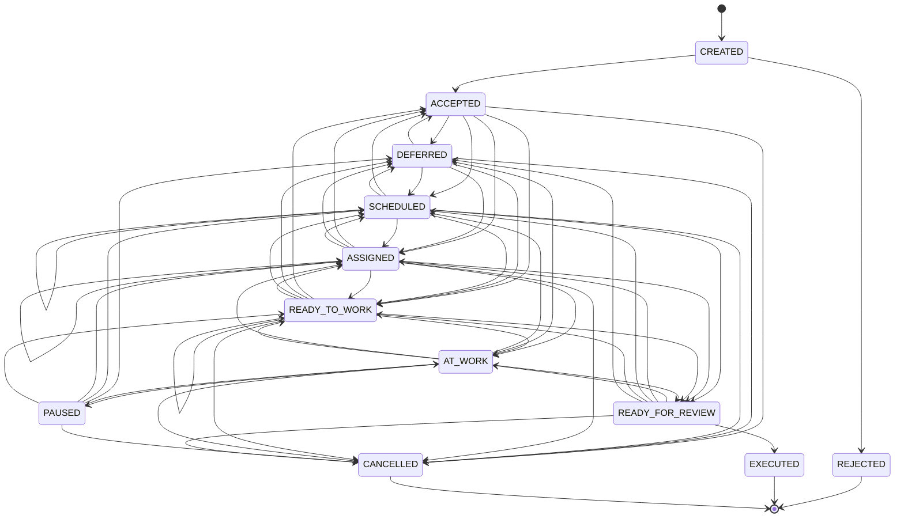

# Workflow Ticket: бизнес-правила, история и граф статусов

## 1. Назначение документа

Этот документ фиксирует workflow внутренней заявки `Ticket`:

* структуру истории статусов;
* смысл каждого статуса;
* допустимые переходы;
* правила для исполнителя, менеджера и review;
* правила изменения полей Ticket;
* границы ответственности domain layer и application layer.

Документ описывает внутренний `Ticket`. Отдельный `TicketUser` пока не создаётся и не участвует в workflow.

---

## 2. Основная модель

`Ticket` не хранит отдельное изменяемое поле текущего статуса.

Вместо этого он хранит историю workflow-событий:

```python
ticket.statuses: list[TicketStatusRecord]
```

Каждое изменение workflow добавляет новую неизменяемую `TicketStatusRecord`.

Например:

```text
SCHEDULED → SCHEDULED
```

не обновляет старую плановую запись, а означает отдельное бизнес-событие:

```text
заявка перепланирована
```

Аналогично:

```text
ASSIGNED → ASSIGNED
```

означает:

```text
исполнитель переназначен
```

Старые status records не редактируются и не удаляются. Каждое новое workflow-действие добавляет новую запись.

Текущий статус определяется последней записью:

```python
ticket.current_status() == ticket.statuses[-1].status
```

Порядок истории в persistence определяется `status_id`, а не фактическими датами выполнения работы.

---

## 3. `TicketStatusRecord`

Каждая status record содержит:

```text
status_id
actor_employee_id
status
date_created

executor_id

planned_start_at
planned_finish_at

actual_started_at
actual_finished_at

comment
```

Смысл полей:

```text
actor_employee_id
    сотрудник, который зарегистрировал workflow-событие.

executor_id
    исполнитель в данном состоянии.
    0 в domain / NULL в SQL означает, что исполнителя нет.

date_created
    момент создания workflow-record в системе.

planned_start_at / planned_finish_at
    плановые даты выполнения.

actual_started_at / actual_finished_at
    фактический интервал выполнения работы.

comment
    причина или пояснение конкретного workflow-события.
```

`date_created` и `actual_*` описывают разные вещи.

Например, инженер мог завершить работу утром, а зарегистрировать её вечером:

```text
date_created       = 18:00
actual_started_at  = 09:00
actual_finished_at = 10:30
```

---

## 4. Текущий статус и текущий исполнитель

### Текущий статус

Источник истины о текущем статусе:

```python
ticket.current_status()
```

Он возвращает статус последней status record.

### Текущий исполнитель

Источник истины о текущем исполнителе — только текущая status record:

```python
ticket.current_executor_id()
```

Он возвращает:

```python
ticket.current_status_record().executor_id
```

Нельзя искать «последнего исполнителя в истории».

Пример:

```text
READY_TO_WORK executor_id=20
SCHEDULED     executor_id=0
```

После перехода в `SCHEDULED` текущего исполнителя нет, даже если ранее Ticket была назначена сотруднику `20`.

---

## 5. Обычные комментарии и комментарии workflow

В Ticket есть два разных вида комментариев.

### Комментарий status record

```python
TicketStatusRecord.comment
```

Это комментарий к конкретному workflow-событию.

Примеры:

```text
«Отклонено: обращение не относится к нашей службе».

«Отложено: ожидаем доступ в серверную».

«Отменено: клиент отозвал запрос».
```

Для следующих статусов комментарий обязателен:

```text
REJECTED
DEFERRED
CANCELLED
```

### Обычный комментарий Ticket

```python
Ticket.comments
```

Это журнал сообщений и уточнений по заявке.

Примеры:

```text
«Пользователь уточнил номер кабинета».

«Инженер созвонился с контактным лицом».

«После закрытия пользователь подтвердил, что проблема не повторяется».

«Создана новая Ticket #145, потому что проблема относится к другому сотруднику».
```

Обычные комментарии можно добавлять во всех состояниях, включая terminal:

```text
REJECTED
EXECUTED
CANCELLED
```

Комментарий не изменяет workflow, статус, department, исполнителя или исторические поля Ticket.

Закрытая Ticket не может быть изменена как рабочая заявка, но её журнал остаётся доступным для дополнения.

---

## 6. Политика изменения полей Ticket

У разных полей разные правила изменения.

| Поле              | Правило                                              |
| ----------------- | ---------------------------------------------------- |
| `text_of_ticket`  | Можно менять только в `CREATED` и `ACCEPTED`.        |
| `description`     | Можно менять во всех нетерминальных состояниях.      |
| `user_id`         | Устанавливается при создании и пока не меняется.     |
| `contact_user_id` | Устанавливается при создании и пока не меняется.     |
| `department_id`   | Меняется отдельной командой по специальной политике. |
| Обычные уточнения | Добавляются через `Ticket.comments`.                 |

### `text_of_ticket`

`text_of_ticket` — основная формулировка заявки.

Пример:

```text
«У сотрудника не работает интернет».
```

Её можно изменить только в:

```text
CREATED
ACCEPTED
```

После `ACCEPTED` смысл заявки не переписывается. Новые сведения добавляются в комментарии.

При создании и изменении текста:

```text
- пробелы по краям удаляются;
- пустой текст запрещён.
```

### `description`

`description` — актуальная вспомогательная информация для выполнения работы.

Примеры:

```text
- кабинет;
- как проехать;
- контакт на месте;
- код двери;
- особенности доступа;
- расположение оборудования;
- допустимое время посещения.
```

`description` можно изменять во всех нетерминальных состояниях:

```text
CREATED
ACCEPTED
DEFERRED
SCHEDULED
ASSIGNED
READY_TO_WORK
AT_WORK
PAUSED
READY_FOR_REVIEW
```

В terminal-состояниях `description` не меняется:

```text
REJECTED
EXECUTED
CANCELLED
```

### `user_id` и `contact_user_id`

```text
user_id
    пользователь клиента, который инициировал обращение.

contact_user_id
    пользователь, в интересах которого выполняется работа.
```

Эти поля устанавливаются при создании Ticket и пока не меняются.

Если позднее выяснится, что Ticket относится к другому пользователю, не нужно переписывать старую Ticket. В будущем для этого будет отдельный сценарий:

```text
ticket.copy(...)
```

Он создаст новую Ticket в `CREATED` с возможностью изменить нужные поля, а исходная Ticket сохранится исторически корректной.

---

## 7. Статусы Ticket

Текущий набор статусов:

```text
CREATED
REJECTED
ACCEPTED
DEFERRED
SCHEDULED
ASSIGNED
READY_TO_WORK
AT_WORK
PAUSED
READY_FOR_REVIEW
EXECUTED
CANCELLED
```

`OFFLINE_WORK` не является статусом.

Ретроспективно зарегистрированная работа — это переход сразу в:

```text
READY_FOR_REVIEW
```

с заполненными фактическими датами работы.

---

## 8. Смысл статусов и допустимый payload

### CREATED

Ticket создана, но ещё не признана рабочей.

```text
executor_id          отсутствует
planned_*            отсутствуют
actual_*             отсутствуют
```

Допустимые переходы:

```text
CREATED → ACCEPTED
CREATED → REJECTED
```

---

### REJECTED

Ticket отклонена до принятия в работу.

```text
REJECTED — terminal status
```

```text
executor_id          отсутствует
planned_*            отсутствуют
actual_*             отсутствуют
comment              обязателен
```

Workflow и рабочие поля не меняются.

Обычные комментарии добавлять можно.

---

### ACCEPTED

Ticket признана корректной и может быть обработана.

```text
executor_id          отсутствует
planned_*            отсутствуют
actual_*             отсутствуют
```

Допустимые переходы:

```text
ACCEPTED → DEFERRED
ACCEPTED → SCHEDULED
ACCEPTED → ASSIGNED
ACCEPTED → READY_TO_WORK
ACCEPTED → CANCELLED
```

Из `ACCEPTED` нельзя напрямую перейти в `AT_WORK`.

Перед обычным началом работы должна появиться запись назначения:

```text
ACCEPTED
→ ASSIGNED
→ AT_WORK
```

или:

```text
ACCEPTED
→ READY_TO_WORK
→ AT_WORK
```

---

### DEFERRED

Ticket отложена.

Типовые причины:

```text
- нужны данные от клиента;
- требуется согласование;
- нет доступа;
- нужны материалы;
- требуется решение менеджера;
- нужна передача в другой department;
- клиент временно отключён.
```

```text
executor_id          отсутствует
planned_*            отсутствуют
actual_*             отсутствуют
comment              обязателен
```

Допустимые переходы:

```text
DEFERRED → ACCEPTED
DEFERRED → SCHEDULED
DEFERRED → ASSIGNED
DEFERRED → READY_TO_WORK
DEFERRED → CANCELLED
```

---

### SCHEDULED

Ticket запланирована, но исполнитель ещё не назначен.

```text
executor_id          отсутствует
planned_start_at     обязателен
planned_finish_at    опционален
actual_*             отсутствуют
```

Повторный переход:

```text
SCHEDULED → SCHEDULED
```

означает перепланирование.

Допустимые переходы:

```text
SCHEDULED → SCHEDULED
SCHEDULED → ACCEPTED
SCHEDULED → DEFERRED
SCHEDULED → ASSIGNED
SCHEDULED → READY_TO_WORK
SCHEDULED → READY_FOR_REVIEW
SCHEDULED → CANCELLED
```

Переход:

```text
SCHEDULED → READY_FOR_REVIEW
```

допустим только как ретроспективная регистрация уже выполненной работы.

В новой `READY_FOR_REVIEW` record обязательны:

```text
executor_id
actual_started_at
actual_finished_at
```

---

### ASSIGNED

Назначен исполнитель.

```text
executor_id          обязателен
planned_*            отсутствуют
actual_*             отсутствуют
```

Повторный переход:

```text
ASSIGNED → ASSIGNED
```

означает переназначение.

Допустимые переходы:

```text
ASSIGNED → ASSIGNED
ASSIGNED → ACCEPTED
ASSIGNED → DEFERRED
ASSIGNED → SCHEDULED
ASSIGNED → READY_TO_WORK
ASSIGNED → AT_WORK
ASSIGNED → READY_FOR_REVIEW
ASSIGNED → CANCELLED
```

Переход:

```text
ASSIGNED → READY_FOR_REVIEW
```

возможен только как ретроспективная фиксация завершённой работы.

---

### READY_TO_WORK

Есть и исполнитель, и план выполнения.

```text
executor_id          обязателен
planned_start_at     обязателен
planned_finish_at    опционален
actual_*             отсутствуют
```

Смысл:

```text
конкретный сотрудник должен выполнить работу
в запланированный период.
```

Повторный переход:

```text
READY_TO_WORK → READY_TO_WORK
```

означает новое назначение с новым планом.

Допустимые переходы:

```text
READY_TO_WORK → READY_TO_WORK
READY_TO_WORK → ACCEPTED
READY_TO_WORK → DEFERRED
READY_TO_WORK → SCHEDULED
READY_TO_WORK → ASSIGNED
READY_TO_WORK → AT_WORK
READY_TO_WORK → READY_FOR_REVIEW
READY_TO_WORK → CANCELLED
```

Переход:

```text
READY_TO_WORK → READY_FOR_REVIEW
```

может означать, что работа была выполнена, но зарегистрирована позже.

В новой `READY_FOR_REVIEW` record обязательны:

```text
executor_id
actual_started_at
actual_finished_at
```

---

### AT_WORK

Работа по Ticket выполняется в данный момент.

```text
executor_id          обязателен
actual_started_at    обязателен
planned_*            отсутствуют
actual_finished_at   отсутствует
```

При обычном начале работы `actual_started_at` устанавливает система:

```python
actual_started_at = now()
```

Рабочее время в `AT_WORK` считается по истории статусов:

```text
AT_WORK.date_created
    →
дата следующей status record
```

Если `AT_WORK` является текущим статусом:

```text
AT_WORK.date_created
    →
now()
```

Допустимые переходы:

```text
AT_WORK → PAUSED
AT_WORK → READY_FOR_REVIEW

AT_WORK → DEFERRED
AT_WORK → SCHEDULED
AT_WORK → ASSIGNED
AT_WORK → READY_TO_WORK
AT_WORK → CANCELLED
```

Первые два перехода — обычные действия исполнителя.

Остальные — управленческие или аварийные переходы.

---

### PAUSED

Работа начиналась, но временно остановлена.

```text
executor_id          обязателен
planned_*            отсутствуют
actual_*             отсутствуют
```

Отличие от `DEFERRED`:

```text
PAUSED
    внутренняя временная остановка начатой работы;
    исполнитель сохраняется.

DEFERRED
    заявка отложена по внешней или управленческой причине;
    текущий исполнитель отсутствует.
```

Допустимые переходы:

```text
PAUSED → AT_WORK

PAUSED → DEFERRED
PAUSED → SCHEDULED
PAUSED → ASSIGNED
PAUSED → READY_TO_WORK
PAUSED → CANCELLED
```

---

### READY_FOR_REVIEW

Исполнитель завершил свой этап работы, но результат ещё не подтверждён.

```text
executor_id          обязателен
actual_finished_at   обязателен
planned_*            отсутствуют
```

`READY_FOR_REVIEW` может быть создана двумя путями.

#### Онлайн-работа через `AT_WORK`

История:

```text
... → AT_WORK → READY_FOR_REVIEW
```

В `READY_FOR_REVIEW` record:

```text
executor_id
actual_finished_at
actual_started_at = None
```

Начало работы уже отражено записью `AT_WORK`.

Недопустимо:

```text
AT_WORK → READY_FOR_REVIEW
с новым actual_started_at
```

#### Ретроспективная регистрация завершённой работы

История:

```text
SCHEDULED
    → READY_FOR_REVIEW

ASSIGNED
    → READY_FOR_REVIEW

READY_TO_WORK
    → READY_FOR_REVIEW
```

В новой `READY_FOR_REVIEW` record обязательны:

```text
executor_id
actual_started_at
actual_finished_at
```

Недопустимо:

```text
SCHEDULED / ASSIGNED / READY_TO_WORK
    → READY_FOR_REVIEW
без actual_started_at
```

Для ретроспективно зарегистрированной работы:

```text
actual_started_at <= actual_finished_at
actual_started_at не может быть в будущем
actual_finished_at не может быть в будущем
```

Допустимые переходы:

```text
READY_FOR_REVIEW → EXECUTED
READY_FOR_REVIEW → AT_WORK
READY_FOR_REVIEW → ASSIGNED
READY_FOR_REVIEW → SCHEDULED
READY_FOR_REVIEW → READY_TO_WORK
READY_FOR_REVIEW → DEFERRED
READY_FOR_REVIEW → CANCELLED
```

---

### EXECUTED

Работа выполнена и подтверждена.

```text
EXECUTED — terminal status
```

```text
executor_id          отсутствует
planned_*            отсутствуют
actual_*             отсутствуют
```

Нельзя:

```text
- менять workflow;
- менять text_of_ticket;
- менять description;
- менять department;
- менять user_id или contact_user_id;
- назначать исполнителя;
- перепланировать Ticket.
```

Можно:

```text
- добавить обычный комментарий Ticket.
```

---

### CANCELLED

Ticket была рабочей, но затем снята.

```text
CANCELLED — terminal status
```

```text
executor_id          отсутствует
planned_*            отсутствуют
actual_*             отсутствуют
comment              обязателен
```

Отличие:

```text
REJECTED
    Ticket не прошла первичную проверку.

CANCELLED
    Ticket стала рабочей, но затем была отменена.
```

После отмены нельзя менять workflow и рабочие поля.

Обычные комментарии добавлять можно.

---

## 9. TicketState и граф статусов

Граф статусов хранится только в `TicketState`.

```text
TicketState
    allowed_next
    terminal
    requires_executor
    requires_planned_start
    work_started
    locks_department_change
    allows_ticket_text_update
```

### Значение полей

```text
allowed_next
    допустимые следующие статусы.

terminal
    workflow завершён.

requires_executor
    status record должна содержать executor_id.

requires_planned_start
    status record должна содержать planned_start_at.

work_started
    характеристика текущего активного рабочего состояния:
    AT_WORK, PAUSED, READY_FOR_REVIEW.

locks_department_change
    блокировка изменения department
    для нетерминальных состояний с назначением или выполнением работы.

allows_ticket_text_update
    text_of_ticket разрешено менять только в CREATED и ACCEPTED.
```

Terminal Ticket блокирует изменение department общей terminal-проверкой.

Поэтому для terminal-status:

```text
locks_department_change == False
```

не означает, что department можно изменить. Это означает только, что блокировка в данном флаге не используется: Ticket уже закрыта.

`Ticket` использует `TicketState` напрямую:

```text
Ticket.can_change_status(...)
    проверяет допустимость перехода без изменения aggregate.

Ticket.append_status(...)
    добавляет новую status record
    только при допустимом переходе.
```

Отдельного `TicketWorkflowPolicy` нет.

---

## 10. Граф статусов



---

## 11. Domain services и границы ответственности

### Application layer и RBAC

Application layer отвечает за вопрос:

```text
кто из реальных сотрудников может вызвать use case.
```

Например:

```text
- может ли сотрудник принять Ticket;
- может ли сотрудник назначить исполнителя;
- может ли сотрудник зарегистрировать работу другого исполнителя;
- может ли сотрудник подтвердить выполнение;
- может ли сотрудник удалить Ticket аварийно.
```

Эти правила определяются permissions.

Application service не хранит граф статусов и не должен самостоятельно решать допустимость перехода.

### Ticket

`Ticket` отвечает за локальные инварианты aggregate:

```text
- status history существует;
- terminal Ticket не получает новых workflow-records;
- переход соответствует TicketState;
- current executor берётся из текущей status record;
- производные поля пересчитываются из истории;
- текст Ticket меняется только в CREATED и ACCEPTED;
- description меняется только в нетерминальных состояниях;
- обычные comments можно добавлять в любом состоянии.
```

### TicketManagementService

Управляет административными действиями:

```text
accept
reject
defer
schedule
assign
ready_to_work
cancel
handle_client_disabled
```

### TicketExecutionService

Управляет действиями исполнителя:

```text
take_to_work
pause_work
resume_work
submit_for_review
record_completed_work_for_review
```

`record_completed_work_for_review` регистрирует завершённую работу задним числом и создаёт сразу `READY_FOR_REVIEW`.

Он допустим только из:

```text
SCHEDULED
ASSIGNED
READY_TO_WORK
```

### TicketReviewService

Управляет review:

```text
confirm_execution
return_to_work
return_to_assigned
return_to_scheduled
return_to_ready_to_work
return_to_deferred
```

Все review-операции выполняются только из:

```text
READY_FOR_REVIEW
```

---

## 12. Обычные действия исполнителя

Исполнитель — current executor Ticket.

Проверка:

```text
actor_employee_id == ticket.current_executor_id()
```

Исполнитель фиксирует выполнение своей работы, но не определяет управленческую судьбу Ticket.

Обычные действия исполнителя:

```text
ASSIGNED / READY_TO_WORK
    → AT_WORK

AT_WORK
    → PAUSED

AT_WORK
    → READY_FOR_REVIEW

PAUSED
    → AT_WORK

SCHEDULED / ASSIGNED / READY_TO_WORK
    → READY_FOR_REVIEW
    только через record_completed_work_for_review
```

Исполнитель не может самостоятельно:

```text
- принять или отклонить Ticket;
- отложить Ticket;
- отменить Ticket;
- перепланировать Ticket;
- переназначить другого исполнителя;
- сменить department;
- подтвердить EXECUTED.
```

---

## 13. Управленческие и аварийные переходы

Управляющий сотрудник имеет нужный permission в application layer.

Он может выполнять, например:

```text
CREATED → ACCEPTED
CREATED → REJECTED

ACCEPTED / DEFERRED
    → SCHEDULED / ASSIGNED / READY_TO_WORK / CANCELLED

AT_WORK / PAUSED
    → DEFERRED / SCHEDULED / ASSIGNED / READY_TO_WORK / CANCELLED

READY_FOR_REVIEW
    → EXECUTED
    → AT_WORK
    → ASSIGNED
    → SCHEDULED
    → READY_TO_WORK
    → DEFERRED
    → CANCELLED
```

Примеры аварийных сценариев:

```text
исполнитель временно недоступен:
AT_WORK → PAUSED

нужен другой исполнитель:
AT_WORK → ASSIGNED

нужно согласование:
AT_WORK → DEFERRED

нужно создать новый план:
AT_WORK → SCHEDULED
```

---

## 14. Отключение Client

Отключение Client — отдельное бизнес-событие.

`ClientApplicationService`:

```text
- проверяет permission;
- отключает Client;
- загружает связанные нетерминальные Ticket;
- вызывает TicketManagementService.handle_client_disabled(...);
- сохраняет только изменённые Ticket;
- отключает пользователей Client.
```

Application service не хранит граф статусов.

Правила `handle_client_disabled(...)`:

```text
CREATED
    → REJECTED

ACCEPTED
SCHEDULED
ASSIGNED
READY_TO_WORK
    → DEFERRED

DEFERRED
AT_WORK
PAUSED
READY_FOR_REVIEW
REJECTED
EXECUTED
CANCELLED
    → без изменения
```

Причина фиксируется в `TicketStatusRecord.comment`, например:

```text
Client disabled
```

---

## 15. Department

### Admin и Department

```text
Admin может не иметь department.
Admin может принадлежать одному department.
Admin без department не может быть executor.
Disabled Admin не может быть назначен executor.
```

Исполнитель должен принадлежать тому же department, что и Ticket:

```text
executor.department_id == ticket.department_id
```

Admin нельзя перевести в другой department, пока он является current executor незавершённой Ticket.

### Ticket и Department

```text
Ticket может не иметь department.
Ticket без department не может получить executor.
Ticket может принадлежать одному department.
```

Проверки существования Admin и Department, их enabled-state и совпадения department относятся к application layer или отдельной cross-aggregate policy, а не к `Ticket`.

---

## 16. Смена department Ticket

Department меняется отдельной командой:

```python
ticket.change_department(
    department_id=department_id,
)
```

Смена department разрешена в:

```text
CREATED
ACCEPTED
DEFERRED
SCHEDULED
```

В `SCHEDULED` executor отсутствует по определению статуса, поэтому смена department допустима.

Смена department запрещена в:

```text
ASSIGNED
READY_TO_WORK
AT_WORK
PAUSED
READY_FOR_REVIEW
```

В terminal Ticket смена department также запрещена общей terminal-проверкой:

```text
REJECTED
EXECUTED
CANCELLED
```

Изменение department не является update старой status record. Это отдельное изменение Ticket root, которое проходит application-level проверки.

---

## 17. Requires attention

Не вводится отдельный статус `PROBLEM`.

Вместо него используется вычисляемый аналитический признак:

```text
requires_attention
```

Он может быть `True`, если:

```text
- Ticket перепланировалась;
- исполнитель переназначался;
- работа была зарегистрирована задним числом;
- Ticket возвращалась из READY_FOR_REVIEW в работу;
- Ticket была в AT_WORK и затем ушла в DEFERRED / SCHEDULED / ASSIGNED;
- Ticket долго находится в DEFERRED;
- planned_start_at уже прошёл, а Ticket не terminal.
```

`requires_attention`:

```text
- не является workflow-status;
- не является aggregate invariant;
- вычисляется в read-model или аналитическом слое.
```

---

## 18. Предпочтительные backend-операции

UI и API не должны передавать произвольный:

```text
change_status(ticket_id, new_status, payload)
```

Нужны предметные use cases:

```text
accept
reject

schedule
reschedule

assign
reassign
ready_to_work

take_to_work
pause_work
resume_work

submit_for_review
record_completed_work_for_review

confirm_execution
return_to_work
return_to_assigned
return_to_scheduled
return_to_ready_to_work
return_to_deferred

defer
cancel

update_ticket_text
update_description
add_comment
change_ticket_department

handle_client_disabled
```

Одна UI-кнопка может вызывать orchestration из нескольких действий, но каждая новая status record должна отражать отдельный фактический workflow-шаг.
